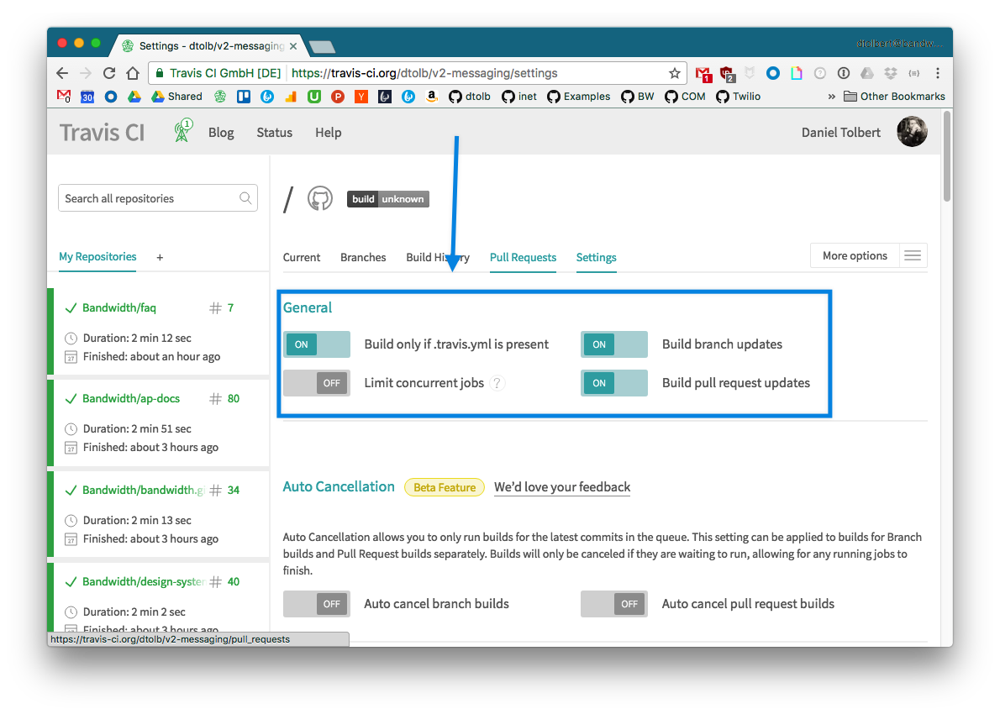
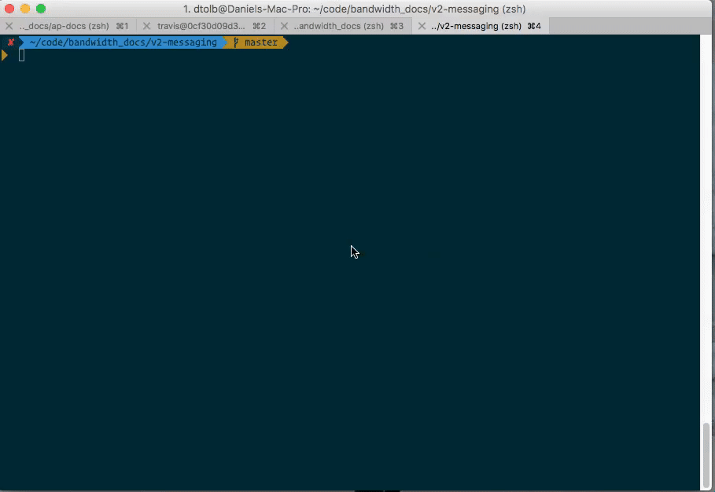
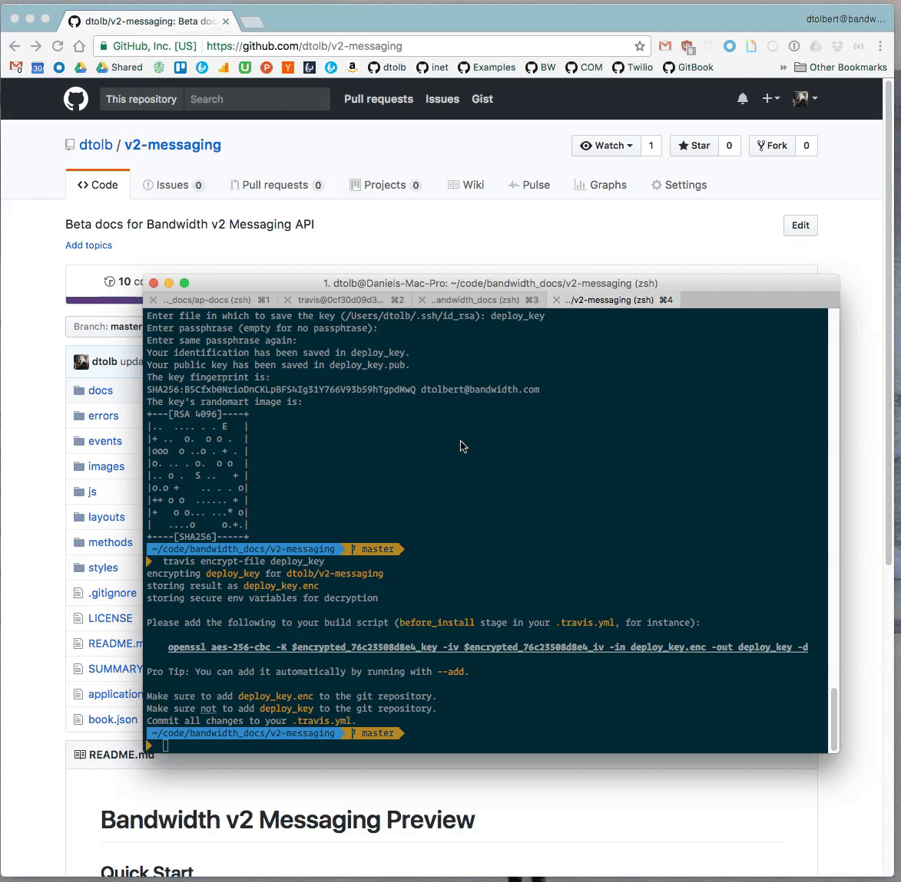

# Auto deploy gitbook with s3 preview travis

### Pre Reqs
* AWS Account
* Gitbook source files
* Github account
* Travis configured for repo

### Github access key

Create a new [token](https://github.com/settings/tokens) to use to make a comment on the pull request.

> Only provide `repo` access


### Travis File



#### final .travis.yml
```yaml
# Easier to work with system python than node
language: node_js
# Just grab stable, we're not picky
node_js:
- stable
before_install:
# download virtual env to manage permissions
- sudo pip install virtualenv
# create virtualenv `my_project`
- virtualenv my_project
# activate the virtualenv
- source my_project/bin/activate
before_script:
# Install the gitbook cli tools
- npm install -g gitbook-cli
# Run deploy script
script: bash ./deploy.sh
after_success:
  # Remove the virtualenv files from the generated gitbook
- rm -rf _book/my_project
# Install the s3 deploy tool
- pip install git+https://github.com/dtolb/s3-deploy-website.git
# Run the tool and specifiy the project name.
# The project name is used to generate the static s3 site
- s3-deploy-website "v2-messaging"
env:
  global:
  - ENCRYPTION_LABEL: 76c23508d8e4
  - COMMIT_AUTHOR_EMAIL: dtolbert@bandwidth.com
  - secure: key1
  - secure: key2
  - secure: key3
```

### Environment variables

```
travis encrypt AWS_SECRET_ACCESS_KEY={{YOUR AWS SECRET ACCESS KEY}} --add
travis encrypt AWS_ACCESS_KEY_ID={{YOUR AWS ACCESS KEY ID}} --add
travis encrypt TRAVIS_BOT_GITHUB_TOKEN={{YOUR GITHUB TOKEN}} --add
```

### Make File

Save this at the root directory as `Makefile` no extension

```makefile
# default action `make`
default: compile

# install the gitbook directroy
gitbook_install:
	gitbook install

# build the gitbook files
gitbook_build:
	gitbook build

# build and serve with live reload
gitbook_serve:
	gitbook serve

# one step make to build: `make`
compile: gitbook_install gitbook_build

# one step make to serve: `make serve`
serve: gitbook_install gitbook_serve
```

### Deploy.sh

Makes the gitbook and deploys to `gh-pages` only on master updates

### Generate Repo key

Generate key named `deploy_key`

```bash
$ ssh-keygen -t rsa -b 4096 -C "you@domain.com"
```

Encrypt the key with travis

```bash
travis encrypt-file deploy_key
```

> `openssl aes-256-cbc -K $encrypted_76c23508d8e4_key -iv $encrypted_76c23508d8e4_iv -in deploy_key.enc -out deploy_key -d`



Grab the key `76c23508d8e4` and add it to your travis.yml file.

* `ENCRYPTION_LABEL: 76c23508d8e4`
* `COMMIT_AUTHOR_EMAIL: you@domain.com`

```yaml
env:
  global:
  - ENCRYPTION_LABEL: 76c23508d8e4
  - COMMIT_AUTHOR_EMAIL: dtolbert@bandwidth.com
  - secure: key1
  - secure: key2
  - secure: key3
  ```

### Add the key to github

Use the `pbcopy` command to copy the file to your clipboard

```bash
pbcopy < deploy_key.pub
```

Copy the public key to your clip board and add it to the repo's only key with write permissions.

`https://github.com/{user}/{repo}/settings/keys`



### Deploy.sh file

Download and save [deploy.sh](https://gist.github.com/dtolb/7d50f67ca40da9f71f9366e90667ba14) to the directory.

This is the file that calls the make command and deploys files to github pages.

Be sure to give it `+x` so it can run locally (if needed) and on travis

```bash
chmod +x ./bash.sh
```

```bash
chmod +x ./deploy.sh
ls -la | grep deploy.sh
-rwxr-xr-x@   1 dtolb  staff  1997 Apr 12 19:32 deploy.sh
```

### Update .gitignore

Be sure to add the deploy keys and the virtualenv files to gitignore. Gitbook could pull those in and serve!

```
## Deploy files
deploy_key.pub
deploy_key
my_project
```

