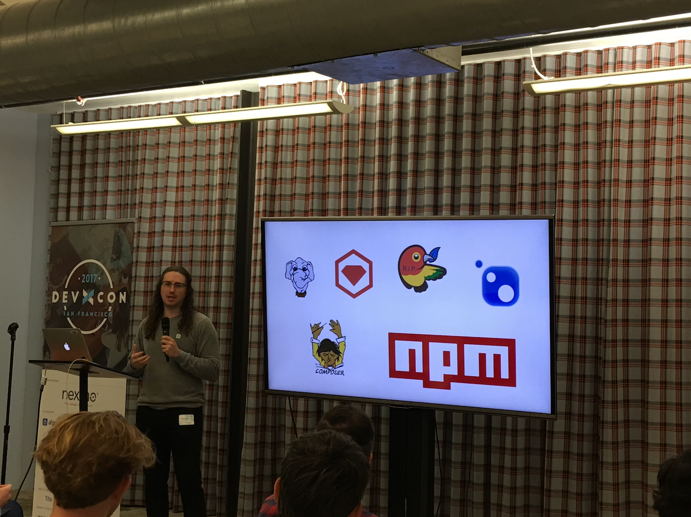
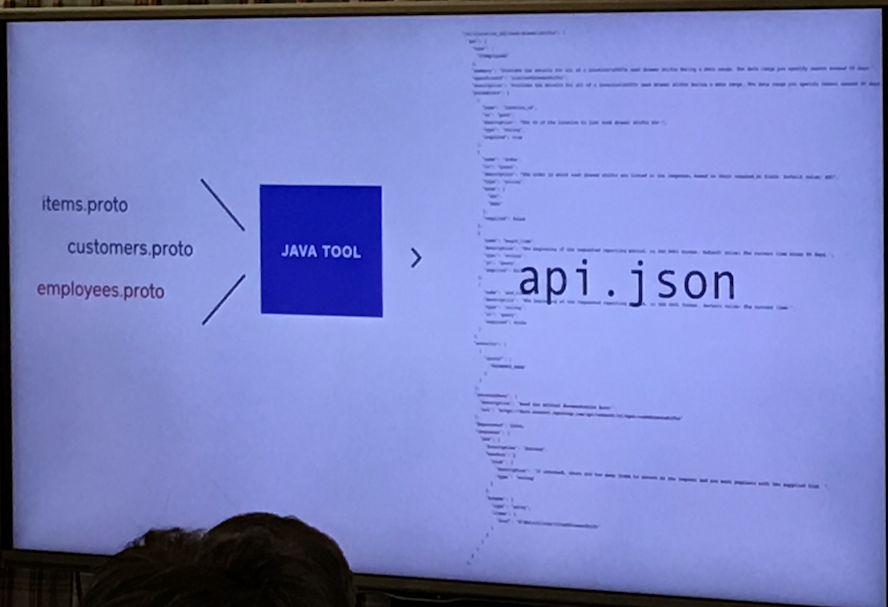
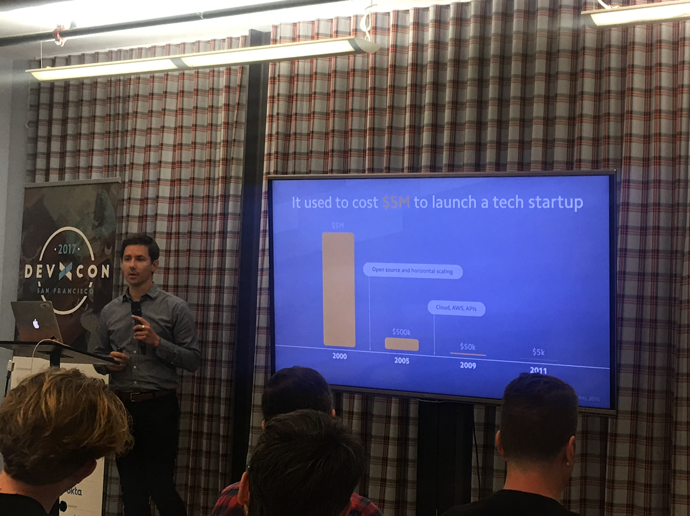

# DEV-X-CON 2017

## Summary

* [Reality Check](#reality-check---how-much-influence-so-developers-really-have)
* [Gloriously Global!](#gloriously-global)
* [We don't learn alone](#we-dont-learn-alone)
* [Making SDKs]()
* [Building for builders]()

## Introduction

* Nexmo is learning and admitting that they are / were sales focused.
* Nexmo adimtted and admired competition with Twilio

## Reality Check - How much influence so developers really have?
### Donnie Berkholz - VP IT Service Delivery

* Devs and IT are majority of the influencers, but the CTI/CIO is majority *Primary Decision* maker.

* [Basho](http://basho.com/) - Provided internal influence where employees helped get `Rev-A` out the door
* [HashiCorp](https://www.hashicorp.com/) - Started out as Dorm Room. - Docs are a _store front_ for developers
	* Documentation has explicit competition comparison - Docs are marketing _not in a bad way_

## Gloriously Global!
### Grace Francisco

* Everyone wants an API, but in order to be successful, you need some sort of Developer Relations.
* Building a devrel team is notoriously difficult.
* In order to have a successful devrel team, the entire org needs to educate, help, and review.

## We don't learn alone
### Anil Dash, Jenn Schiffer - Fog Creek

* Mostly a product demo for [Glitch](https://glitch.com/)

> Glitch looks pretty neat, but not super relevant for the conference.

## Making SDKs: the Bespoke, the Hopeful and the Generated
### Tristan Sokol, Square

* Whatever people can pull down from their package manager is what they're going to use/
* SDK Generation technique - no one likes tooling and maintance around sample apps.
* **Hope** - Putting out a community request and hoping that people use it :(
* **Bespoke** - Hard to have super great depth of knowledge in each language. Population explosion if you spread too thin across mutliple languages, bugs, docs, etc..

#### **Generated** - This is how square does it
* Use some sort of API Specification (swagger, raml, api blueprint) - Tooling is a bit different
* Each internal service provides a proto file which they use to generate the api spec.

* Swagger CodeGen eats a `config.json` file, `api.json`, and `{{templates}}` to make some code
* [github.com/square/connect-api-specification](https://github.com/square/connect-api-specification)
* Travis then will grab any updates from the files and config and builds all of the SDKs and then pushes the output.

## Building for builders: tips for designing a great API and supporting developers
### Romain Huet, Stripe

