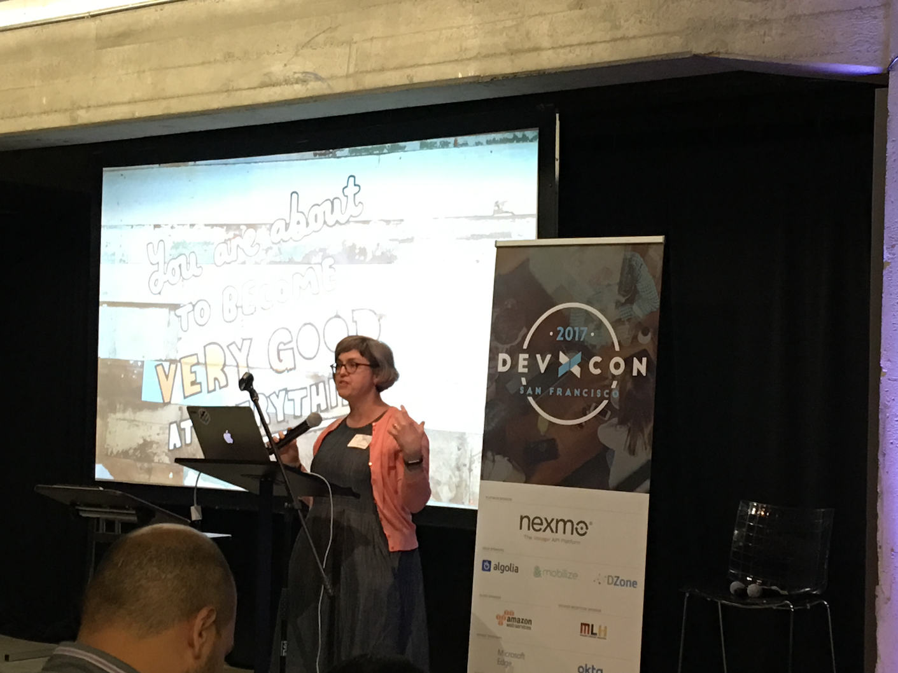

# DEV-X-CON 2017

## Summary

* [Reality Check](#reality-check---how-much-influence-so-developers-really-have)
* [Gloriously Global!](#gloriously-global)
* [We don't learn alone](#we-dont-learn-alone)
* [Making SDKs](#making-sdks-the-bespoke-the-hopeful-and-the-generated)
* [Building for builders](#building-for-builders-tips-for-designing-a-great-api-and-supporting-developers)
* [From Advocacy to Innovation](#from-advocacy-to-innovation-how-user-research-can-improve-the-developer-experience)
* [Supporting new developers](#supporting-new-developers-and-your-api)
* [Measuring the Health of your OSS Community](#measuring-the-health-of-your-oss-community)
* [Building positive developer support experiences](#building-positive-developer-support-experiences)
* [Docs at Weaveworks](#docs-at-weaveworks-dx-from-open-source-to-saas-and-beyond)
* [The seven deadly sins of developer onboarding](#the-seven-deadly-sins-of-developer-onboarding)
* [Developer Influencer](#developer-influencer-lessons-from-a-year-in-devrel-at-google)
* [A CEO's perspective on Devx and DevRel ROI](#a-ceos-perspective-on-devx-and-devrel-roi)
* [So you have a Code of Conduct... now what?](#so-you-have-a-code-of-conduct-now-what)
* [Which Metrics Matter in Developer Relations?](#which-metrics-matter-in-developer-relations)

## Introduction

* Nexmo is learning and admitting that they are / were sales focused.
* Nexmo adimtted and admired competition with Twilio

## Reality Check - How much influence so developers really have?
### Donnie Berkholz - VP IT Service Delivery

* Devs and IT are majority of the influencers, but the CTI/CIO is majority *Primary Decision* maker.

* [Basho](http://basho.com/) - Provided internal influence where employees helped get `Rev-A` out the door
* [HashiCorp](https://www.hashicorp.com/) - Started out as Dorm Room. - Docs are a _store front_ for developers
	* Documentation has explicit competition comparison - Docs are marketing _not in a bad way_

## Gloriously Global!
### Grace Francisco

* Everyone wants an API, but in order to be successful, you need some sort of Developer Relations.
* Building a devrel team is notoriously difficult.
* In order to have a successful devrel team, the entire org needs to educate, help, and review.

## We don't learn alone
### Anil Dash, Jenn Schiffer - Fog Creek

* Mostly a product demo for [Glitch](https://glitch.com/)

> Glitch looks pretty neat, but not super relevant for the conference.

## Making SDKs: the Bespoke, the Hopeful and the Generated
### Tristan Sokol, Square

* Whatever people can pull down from their package manager is what they're going to use/
* SDK Generation technique - no one likes tooling and maintance around sample apps.
* **Hope** - Putting out a community request and hoping that people use it :(
* **Bespoke** - Hard to have super great depth of knowledge in each language. Population explosion if you spread too thin across mutliple languages, bugs, docs, etc..

#### **Generated** - This is how square does it
* Use some sort of API Specification (swagger, raml, api blueprint) - Tooling is a bit different
* Each internal service provides a proto file which they use to generate the api spec.

* Swagger CodeGen eats a `config.json` file, `api.json`, and `{{templates}}` to make some code
* [github.com/square/connect-api-specification](https://github.com/square/connect-api-specification)
* Travis then will grab any updates from the files and config and builds all of the SDKs and then pushes the output.

## Building for builders: tips for designing a great API and supporting developers
### Romain Huet, Stripe

* **Alignment** Align your product with developers needs
* **Engagement** - Provide a speedy on-ramp. _Critical to grab their attention right away_
	* Stripe just lets you play right away _Give them a great first impression_
* **Programming Languages** - Generate snips for as many languages you can support
	* SDKs are **critical** to providing a great DX
	* SDKs **DO NOT REPLACE BAD API DESIGN**
	* Stripe holds weekly API reviews to prevent agains poor API design

>  SDKs **DO NOT REPLACE BAD API DESIGN**

* **Documentation** - Make it dynamic and personalized
	* Test key and then when you log-in everything is copypasta to go
	* Document the API at the source - one main codebase. Code and docs are 1:1.

> The way to a developer's heart is great documentation

* **Error codes and messages** - Make sense, don't be generic
	* Advanced error messages, give as much context as possible.
	* Complete HTTP request logs
* **Support** - Bake it into your API from the beginning.
	* Try to respond in hours, not days.
	* Transparency is paramount - Status pages and honesty about availability
* **Updates to the API** - Whenever possible, avoid breaking changes.
	* Lock in the API versions when deverlopers get started.
	* Security is the only exception.
* **Think Bigger** - What else can you do to help dev's succeed.
	* Build products with your own APIs
	* Think about tooling that can help, if you don't have them, can you build them?
	* Explore ideas in [RunKit](https://runkit.com/home) notebooks

## From Advocacy to Innovation: How User Research can improve the Developer Experience
### Amelia Abreu, Abreu Consulting

* What is care?
	* developing docs, tutorials, security. Show that you care about the people you're providing too.

##### We like to make care invisible

* Anti-patterns
	* _"roll your own"_ - solutions
	* No dedicated resources for documentation
	* Discourages _"stupid questions"_
	* _"Who is this for?"_

##### Design

## Supporting new developers and your API
### Erin McKean, Wordnik

* Give new developers all the keys the kingdom as soon as you can.
* If you ask _"Why don't they just {blank}"_, then you should probably explain _{blank}_
* Provide self-help and look at your logs to find out what errors to know where to focus

## Measuring the Health of your OSS Community
### Jono Bacon

* Can always measure everything that is _tangible_.
* But also take a look at the **human** aspect
	* Happiness
	* Personal Development
	* Relationships
	* Rewarding Experiences

## Building positive developer support experiences
### Bear Douglas, Slack

* There are multiple different inbound paths to support
* Support Quality Affects
	* Adoption
	* Success Rate of integration
	* Customer Satisfactions (CSAT)
	* Willingness to promote (NPS)
	* Retention Over time

* Opening up our product roadmap so that any ideas can be adjusted.
* Engage in real conversation.
* Keep track of when your customers have releases and be pro-active with support.

## Docs at Weaveworks: DX from open source to SaaS and beyond
### Luke Marsden, Weaveworks

* Types of docs
	* Open source projects
	* Guides
		* Step by step
		* interactive labs with [katacoda](https://www.katacoda.com/)
	* Marketing site copy
	* Blog Posts

##### Website Requirements

> Their docs solution is very similar to how our dev site is built.

* Break down docs to:
	* Concepts
	* Tasks
	* Tutorials
	* Reference

## The seven deadly sins of developer onboarding
### Cristiano Betta, Work Betta

1. **Jargon-y** Don't make me run code to see a demo.
2. **Unfocused** Get started that leads to a bucket to nothing.
	* Once sign up, get taken to a blank dashboard.
3. **Undisciplined** Docs Mistakes
	* Product is API + Docs
	* If you don't follow through, you're only delivering what **you** care about. Not what the customer cares about.
4. **Arrogant** Writing docs that are meant to _fix_ stuff instead of _be_ stuff.
	* Get started
	* Guides
	* Reference
	* your product will explain it self**
5. **Scrooge** Don't get ahead of yourself by asking for money first.
	* Twilio and Nexmo only let you play with your phone number **WE NEED THIS**
6. **Frustrated** Don't make me captcha... Use the thing to do the verification
	* Push your problems on the good users
7. **Short Sighted** Don't dog food your product. And don't write your own SDKs
	* Your product _needs_ an SDK

> Hanlon's Razor: Never attribute to malice that which is adequately explained by stupidity

## Developer Influencer: Lessons from a Year in DevRel at Google
### Carter Morgan, Google

* Product gets released and no one in DevRel knew about it.
* Ask users what they want!

## A CEO's perspective on Devx and DevRel ROI
### Alex Salazar, Okta

* How a CEO thinks, 3-D
	* Revenue Growth
	* Predictability & Rist
	* Cost Reduction
* Developer Relations **is** _marketing_
	* Developer Experience **is** _the product_

* Decide on your strategy:
	* Sell product thru devx: (Twilio, Stripe, Okta)
	* Extend Core Product: (box, salesforce)
	* Build Ecosystem: (iOS, Android, Slack)
* Define your personas:
	* Who are you targeting?
		* .net
		* java
		* nodejs
		* etc...
	* What do they care about?
		* Different xp for .net windows env rather than small stack nodejs
	* Where are they?
		* Senior arcitects _aren't_ going to be at a hackathon
* Focus on cost efficiency and repeatability
	* What types of DevRel are effective?
	* What DevX invests have most impact?
	* **Do more of what's working**
	* **Stop doing everything else**

## So you have a Code of Conduct... now what?
### Sarah Sharp, Otter Tech

#### A lot of good information and thoughts to have about Code of Conduct, enforcement, and reporting within a community. Not a ton relevant to Bandwidth

## Which Metrics Matter in Developer Relations?
### Adam FitzGerald, Amazon Web Services

