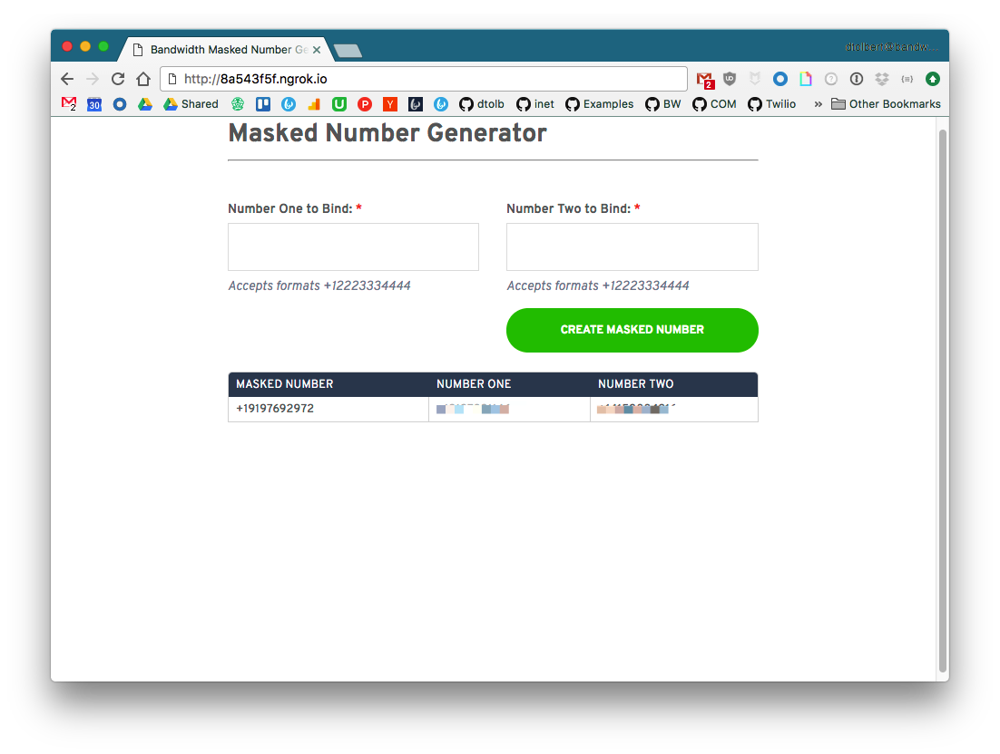

# The Title of the app
> Put Travis and other badges at the top here

[]() []() []()

Description of the app/example and what it should do. This is a first draft on increasing the quality/readability of or examples.

> Put deploy buttons towards the top

[](https://heroku.com/deploy)
[](https://azuredeploy.net/)

> See [example_example.md](./example_example.md) for an Example

## Table of Contents

* [What this Example Does]
* [Prerequisites]
* [Deploy Locally]
* [Deploy to _service_]

## What this Example Does

> A bit different than SDKs, we start with flo

Walk the reader through the primary catapult flow, try to include a link to resource you're using.

This app will:
* [Order a TN](http://dev.bandwidth.com/ap-docs/methods/availableNumbers/postAvailableNumbersLocal.html)
    * If you want to get fancy you can [link to code example](https://github.com/BandwidthExamples/bandwidth-messaging-dashboard/blob/master/routes/index.js#L17)
* [Create an application](http://dev.bandwidth.com/ap-docs/methods/applications/postApplications.html)
* [Create a SIP Domain](http://dev.bandwidth.com/ap-docs/methods/domains/postDomains.html)
* [Create a SIP Endpoint](http://dev.bandwidth.com/ap-docs/methods/endpoints/postEndpoints.html)
* [Handle phone calls](http://dev.bandwidth.com/ap-docs/methods/calls/calls.html)

## Prerequisites
Talk about any prereqs the user should meet before trying to install/use the app.

### Accounts and Machine Setup
* [Bandwidth Voice and Messaging APIs Account](http://dev.bandwidth.com)
    * [If you already have a Bandwidth Account](http://dev.bandwidth.com/security.html)
* [Nodejs](https://nodejs.org/en/)
* [Postgres](http://postgresapp.com/documentation/install.html)
* [Ngrok](https://ngrok.com/) **For local Deployment Only**
* [Heroku](https://signup.heroku.com/) **For Heroku Deployment Only**

### Env Variables
* `BANDWIDTH_USER_ID` - Something like `u-asdf`
* `BANDWIDTH_API_TOKEN` - Something like `t-asf234`
* `BANDWIDTH_API_SECRET` - Something like `asdf123asdf`
* `DATABASE_URL` - Connection path to Postgres DB

## Deploying Locally with ngrok

[Ngrok](https://ngrok.com) is an awesome tool that lets you open up local ports to the internet.


Once you have ngrok installed, open a new terminal tab and navigate to it's location on the file system and run:

```bash
$ cd ~/Downloads/
$ ./ngrok http 3000
```

You'll see the terminal show you information


Copy the `http://8a543f5f.ngrok.io` link and paste it into your browser.

> On first run, the application will create the Bandwidth callbacks and voice/messaging application for you.  Be sure you visit the `ngrok` url and not `localhost`. Bandwidth needs to be able to send callbacks.



## Installing and running

Once [ngrok](#deploying-locally-with-ngrok) is up and running. Open a new tab and clone the repo:

```bash
git clone https://github.com/dtolb/masked-number-api.git
```

Then change into the directory and install [`nodemon`](https://www.npmjs.com/package/nodemon).  `nodemon` watches for changes in the local directory and auto restarts the app.

```bash
cd masked-number-api
```

### Install node modules

```bash
npm install
```

### Run the app

```bash
npm run debug
```

### Open the app using the `ngrok` url

When the app runs for the first time, it setups the Bandwidth voice and messaging callbacks for the application for you.  It sets the callback urls based on the url visited!

## Deploy Heroku or Azure
Manual steps to deploy if they don't want the button

## More information
Any more information that could be relevant to the user