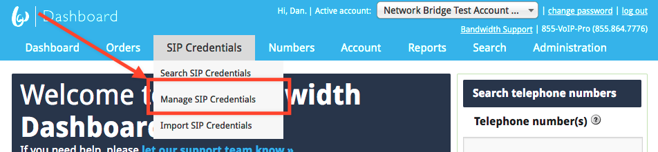
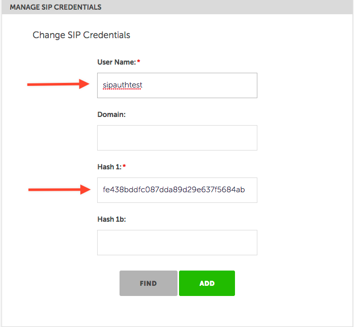

# Using Bandwidth for Outbound Calling (Termination)

This guide walks through the initial setup for Bandwidth's Network Bridge. The network bridge allows you to use Bandwidth to create phone calls using our network.

## Pre-reqs

* [Twilio account](http://twilio.com)
* [Bandwidth dashboard account](http://bandwidth.com)
* Network Bridge activated: [contact sales](https://www.bandwidth.com/)
* Your customer number IE: (`cust11`) _[contact support](http://support.bandwidth.com)_
* Your default port IE: (`5006`) _[contact support](http://support.bandwidth.com)_

## Steps

1. [Create new SIP credentials](#create-new-sip-credentials)
2. [Create call via Twilio with new SIP creds](#create-new-sip-credentials)

## Create new SIP Credentials

In order to route the outbound calls through Bandwidth, you will need to create a new set of SIP credentials.

| Value      | Required     | Description                                                                                                                                                                                                                                                                 |
|:-----------|:-------------|:----------------------------------------------------------------------------------------------------------------------------------------------------------------------------------------------------------------------------------------------------------------------------|
| `Username` | **required** | String identifying the user.                                                                                                                                                                                                                                                |
| `Domain`   | _optional_   | String refining the identity of the user. <br> The Domain will be joined to the UserName with an `@` to create a composite username. For example, the UserName `bob` could be combined with the domain `somewhere.com` to create a _composite username_ `bob@somewhere.com` |
| `Hash1`    | **required** | String representing a potential Hash values used to authenticate the client. <br> The value should be computed from an MD5 Hash of `{composite-username}:{Realm}:{Password}`.                                                                                               |
| `Hash1b`   | _optional_   | String representing a potential Hash value used to authenticate the client. <br> The value should be computed from an MD5 Hash of `{composite-username}:{Realm}:{Domain}:{Password}`. <br> **If the Domain is not specified the Hash1b is not required.**                   |

_The Twilio platform requires a SIPAuthUsername and a SIPAuthPassword. Assuming that your username=sipauthtest and password=password_

### Generate MD5 hash from username and password

Either using the command line or an [online tool](http://www.miraclesalad.com/webtools/md5.php) generate the md5 hash from the username and desired password.

Most *nix (mac, linux) come with md5 hash built in. Check that md5 is installed by opening up the terminal and typing:

```
$ which md5
/sbin/md5
```

Once md5 is insalled, run the command like: `md5 -s {composite-username}:{Realm}:{Password}`:

md5 -s dtolb:cust83.auth.bandwidth.com:password

###### Generate md5 Hash1
```
$ md5 -s sipauthtest:custxx.auth.bandwidth.com:password
MD5 ("sipauthtest:custxx.auth.bandwidth.com:password") = fe438bddfc087dda89d29e637f5684ab
```

###### Generate md5 Hash1b _with domain_
```
$ md5 -s sipauthtest@custxx.auth.bandwidth.com:custxx.auth.bandwidth.com:password
MD5 ("sipauthtest@custxx.auth.bandwidth.com:custxx.auth.bandwidth.com:password") = 79bb0e55551e14a2f329a282c7cf1456
```

### Add the newly created hash to the SIP Credentials

After generating the hash value, fill in the **Hash 1** value to create the SIP creds.

#### Using the UI

Expand the SIP Credentials menu and select **Manage SIP Credentials**:



Then fill in the values generated and selected and click **ADD**:



#### Using the REST API

You can also use the API to create SIP creds after generating the md5 hash value.

###### Create new SIP Credentials
```http
POST /accounts/{accountId}/sipcredentials
Content-Type: text/xml

<SipCredentials>
    <SipCredential>
        <UserName>sipauthtest</UserName>
        <Hash1>fe438bddfc087dda89d29e637f5684ab</Hash1>
    </SipCredential>
</SipCredentials>
```

And that's it on the Bandwidth side! Now move over to Twilio

## Create call using the Network Bridge

To create a call using the network bridge format the `TO` field like `sip:{Desired_to_number}@custxx.auth.bandwidth.com` and inclue the values `SipAuthUsername` as the username created above and `SipAuthPassword` as the password used to create the md5 hash.

### Examples:

#### Curl

```bash
curl 'https://api.twilio.com/2010-04-01/Accounts/{AccountId}/Calls.json' -X POST \
--data-urlencode 'To=sip:+17778889999@custxx.auth.bandwidth.com' \
--data-urlencode 'From=+15553334444' \
--data-urlencode 'Url=http://requestb.in/zolm8azo' \
--data-urlencode 'SipAuthUsername=sipauthtest' \
--data-urlencode 'SipAuthPassword=password' \
-u {AccountId}:{AuthToken}
```

#### Pyton

```python
call = client.calls.create(to="sip:+17778889999@custxx.auth.bandwidth.com",
                           from_="+15553334444",
                           url="http://requestb.in/zolm8azo",
                           SipAuthUsername="sipauthtest",
                           SipAuthPassword="password")
```

