# Signal 2018 Day 1


## Index
* [Day 1 Keynote](#day-1-keynote)
  * [Flex](#flex)
  * [Pay](#pay)
  * [Autopilot](#autopilot)
* [Target's Guide](#targets-guide)
* [Twilio and Whatsapp](#twilio-and-whatsapp)
* [Grubhub](#grubhub)
* [SMS at Scale](#sms-at-scale)
* [How we built our Super Network](#how-we-built-our-super-network)
* [Building Phone Verification at Scale](#building-phone-verification-at-scale)

## Day 1 Keynote

* Home depot talked to how they're using twilio to manage "Where is my order" style notifications.


* Jeff talks about how APIs democratize the future
  * Nordstrom uses APIs to build communications to connect tailors and stylist
  * Dominos uses Alexa & APIs to wire-up pizza and people

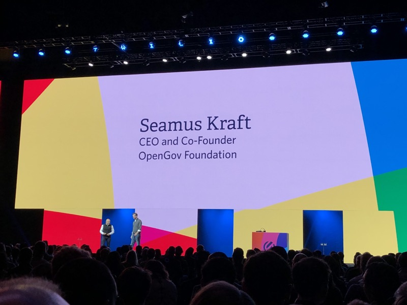

* OpenGov Foundation is working to connect constituents to elected officials
* Average age of Federal Technology is 15 years old
  * Senate voicemail inbox capacity it 300 total voicemails
* Article1 gives the Senate unlimited voicemails
  * Transcribes the voicemails automatically
  * Adds text message to congress
  * When you call, you get an auto-text acknowledging the call
* Want to rebuild the communications systems that connect elected officials

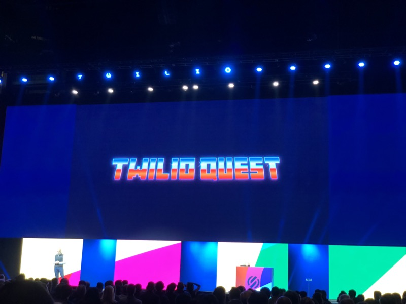

* Twilio quest has racked up over 100 million points
* Twilioquest is expanding and to get more people learning to code
* Now has a cute lil 2D game mode
* Set goals for what Twilio looks like in 2023
  * 50% employees women
  * 30% Under-represented populations

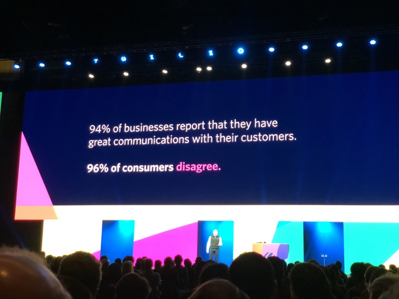

* Business engagement is not going as well as expected
* Internal systems are fighting themselves
* Great experiences when done correctly are memorable (Texting a hotel for lost key (Kipsu))
* Built the [Engagement Cloud](https://www.twilio.com/engagement-cloud)
* Adding to every part of the customer journey
  * marketing
  * Call tracking
  * Alerts
  * Account Verification
  * Payments
  * etc...
* Redfin has started to build out better integrations
* 1800-Flowers
  * Alerts, payments, touch points all drive better CX
  * Use twilio studio to model flows first
  * Saving $ by deflecting calls with proactive notifications
* Fedex Cross Border
  * Mission is to get better at cross-border sales (Global Commerce)
  * Dealing with customs, shipping, etc...
  * How to make notifications realtime in a global landscape
  * Without communications there is no commerce

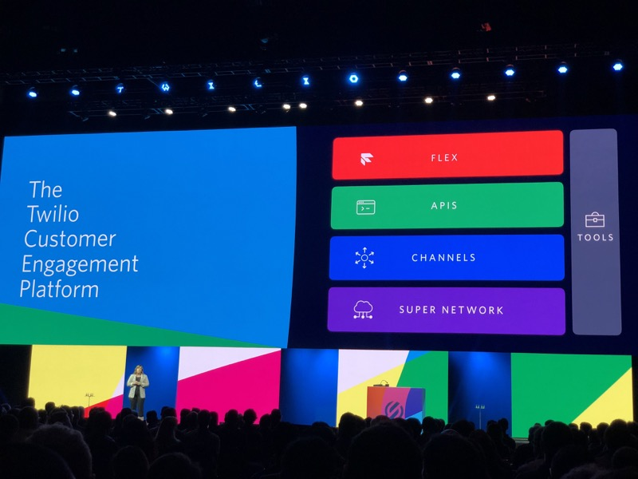

* Based on the software layer on top of the network
* If they know about an issue, they can route around outages
* Have over 1 trillion datapoints processing
* **Can detect 97% of incidents in realtime**
* All the complexity is managed away
* ISO, CSA, AICPA, GDPR Compliance
* Becoming more difficult to keep track of all the channels
* Channels are not stopping, (RCS & Apple Business Chat)
* **Really pushing the single integration point**


* Sending emails is easy... **delivering** emails is much more difficult
* Sendgrid has a _supernetwork_ of ISPs to avoid SPAM filtering
* High scale & high reliability
* Really talking about trust
* 74,000 companies use sendgrid
* over 1 million developers
* Send about half trillion emails per year

### Flex

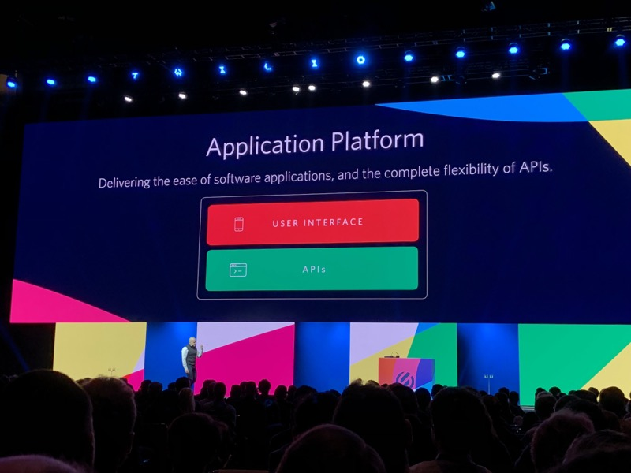

* Speed of an app with the flexibility of an API
* **Pushing flex hard**
* "We are stuck with an on-prem install with Professional Services" -or- "We can deploy a SaaS app and we can't change anything"
* Tested with contact centers with 50k agents

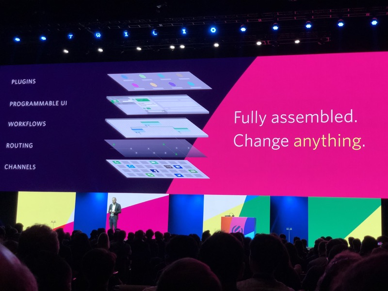

* Flex is extended through plugins
* Updates are outside of the continuous updates
* Quick updates w/not a ton of code
* Flex plugin builder based of create-react-app (runs flex locally while building)
* Components are modular and can be moved around
* Relatively rapid A & B testing on call center
* Pricing typical is a per-seat model for a call-center
* Flex can be paid by "Per active user per hour"

[top](#index)

### Pay


* Talk a lot about technology to consumers
* Showcase that the "dominos brand" is easy to use
* What is next for dominos?
  * Customers wanted better pizza tracking methods
  * Push
  * Alexa
  * SMS
* 60%+ of orders are all e-orders
* 30% of orders are over the phone (credit card)
* Moving forward to payments (PCI compliance)


* Twilio now supports `<Pay>` over the phone without forcing _you_ to be PCI compliance.
* Developer toolkit is rapidly expanding
* Increase revenue by reducing friction (convert to payed)
* A new TwiML verb `<Pay>` to get up and running
* Has a Flex Plugin to capture information
* Has voice today, will be bringing to all Channels (Mobile payment (apple/google))

#### Sample TwiML for `<Pay>`

```xml
<?xml version="1.0" encoding="UTF-8"?>
<Response>
    <Say> Welcome to kickflip boards</Say>
    <Pay chargeAmount="59.99" action="{url}"/>
</Response>
```

[top](#index)

### Autopilot


* Need a new type of tool for bots to exceed
* Needs to be conversational, omnichannel, NLP support
* The future is still conversational... we have been reacting to how computers work, we want to force computers to adapt to us.
* Autopilot Actions
  * `{Say}` → Speak
  * `{Show}` → Display
  * `{Remember}` → Keep for context
  * `{Collect}` → _web_ form style get information
    * Has validation built in (handles non-happy path pretty well)
  * `{Handoff}` → Send to agent
  * `{Redirect}` → Redirect
* Omnichannel **just** kinda works
* Can add some personality to the bots through Stylesheets (voice, etc...)
  * Define `on_failure` and `on_success` with multiple phrases to keep it up.
* for very well defined workflows people like automated assistants
* "Natural Language Router"
  * Can route to data collection
  * Question Answering
  * Human
* `{Handoff}`
  * Can pipe into flex for callcenter

[top](#index)

## Target's Guide
### [Josh Hoium](https://signal.twilio.com/speakers/hD5G-MQxEei3-gpYClQEBw)

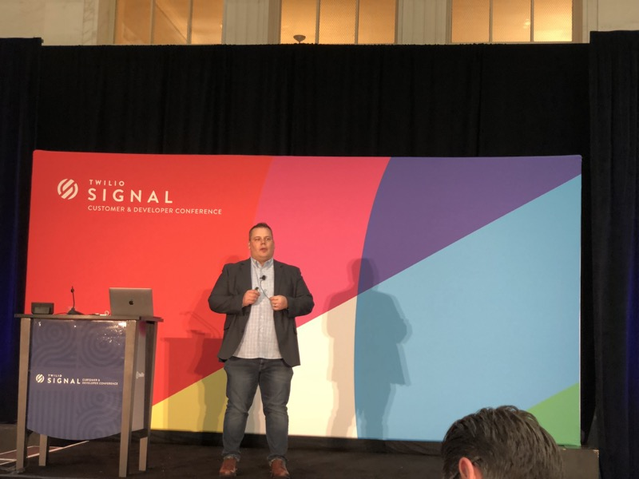

> We decided to use the vendor solution because I don't think your team can deliver

#### Work didn't work

* Lots of old stuff, some other than 30 years old
  * Literally buying things from eBay to keep it up
* Slow speed to market
  * used to use a lot of vendors
  * Go to vendor (hey we want this feature)
  * Vendor won't do the use-case; not going to fit in their priority
  * We'll build this component but we need you to invest as well
* Very low NPS with internal teams
  * Part of the process in the build versus buy systems. you **need** to survey your customers
  * Seeing NPS scores in the 40s & 50s (people weren't trusting)

#### Fostering Change

* Need to create innovative culture
  * Need to just play around with some things
  * Created a bullseye speech assistant dog
    * Never going to go to production (but learned lots of businesses)
* Product Focus
  * Talked to everyone at a store
  * What leaders thought were happening wasn't actually happening
  * Without a strong product culture you're gonna struggle
* Open/API First Services
  * If your (_internal_) products can't interface, you're not doing it right
* Sell Journey and Change with Build vs Buy
  * Sell the journey and the improvements **not** how much money you're going to save
  * What friction you're going to remove → Better product

#### Team Transformation takes time

* Teams need to skill up and need to buy into the future vision
  * Continual learning (hardware going to software)
  * Good to keep tribal knowledge and grow folks
* Partnerships are key
  * How do you talk to a customer about what they're looking for and how you're going solve it
    * Talk in terms they understand
* Progress over perfections
  * Something to sell "upwards" discover what you need versus want
  * Senior leaderships needs things tied to KPIs

#### Integration in Communications

* Wanted to integrate SMS (got quoted $250k)
* Took 3 days to build out a spike
* were able to pump out MVP in 3 hours

#### Building Partnerships builds a solid product

* Result have been significant
  * Needed a notification system in 6 weeks
    * Texts, calls, emails, gathers responses
  * In the amount of time the vendor negotiations were happening, they had an MVP
* Far less reliant on vendors for work
* Team is more engaged
* Product consumption is up significantly

> The work your team has completed on the TGTAlert application has made me rethink how I engaged IT

* Built some stories with the product owners
* Beginning to reuse some of the smaller products
* Able to cross-use data

[top](#index)

## Twilio and Whatsapp
### [Rahma Javed & Anne Byrne](https://signal.twilio.com/sessions/KeMDqpzcEeiHpQpYClWZDA)

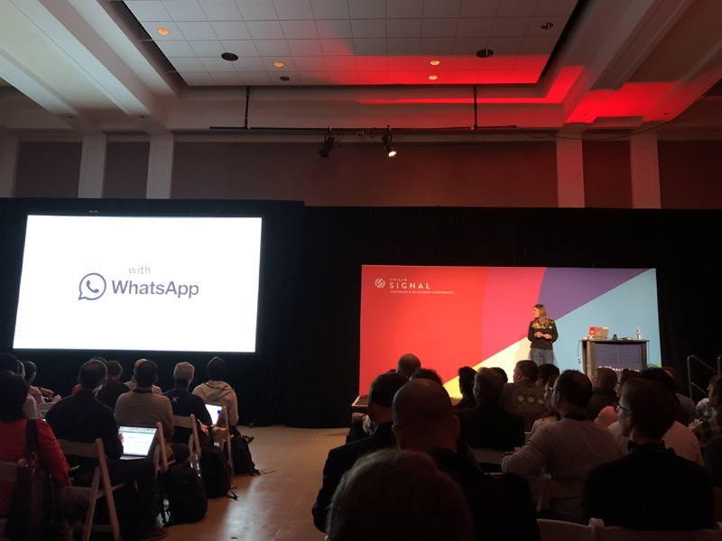

>WhatsApp was designed as a pure peer-to-peer messaging network with end-to-end encryption between devices. Rather than hitting a central API, WhatsApp business messaging requires hosting, managing and scaling Docker containers that emulate “devices” on the network. In this talk, we’ll dig into how we built the processes, infrastructure and orchestration necessary to reliably do this at scale. We’ll hear from Deliveroo on how they were able to integrate WhatsApp notifications in just a few weeks and the impact it’s had on their business.

* Big difference in usage compared to SMS in the USA versus the rest of the world
* Whatsapp Deliverability is a bit better than SMS in certain locales
* 1.5 **Billion** active users
* 320 Million in India and Brazil only
* 50 **Billion** messages daily

#### Channels

* Whatsapp, Line, RCS, Messenger, & More
* Need some sort of `to` & `from` & `body`
* **normalized** the messages structure
  * prepend `whatsapp` to the phone number IE: `{to: "whatsapp:+18282223333"}`
* Reused the messaging (sms) Queue, rate limit, etc... infrastructure
* Have to transform the normalized message into each specific API
  * Each service has to auth
  * How does media work
  * What is the content type
* Transforms are managed through a configuration file (config / convention → But internal)

#### Whatsapp Business API

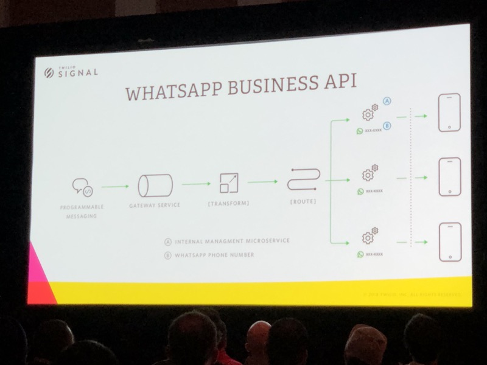

* End-to-end encrypted & peer-to-peer
* Comms must flow through "devices" with unique phone numbers and rotating keys
* Device Emulation (docker)
* Containers must run in-house in AWS/GCP
* Integrate with containers web API.
* One set of containers per phone number
* Supporting multiple countries and several phone numbers, infrastructure gets crazy
* In order to even get started with the containers, you have to request access.
* Gets tedious and time consuming if you're managing many numbers
* Whatsapp API versions deprecate every 180 days
* Auth tokens are not ephemeral (Generated once). Have to request and securely store the messages
* Tokens expire weekly

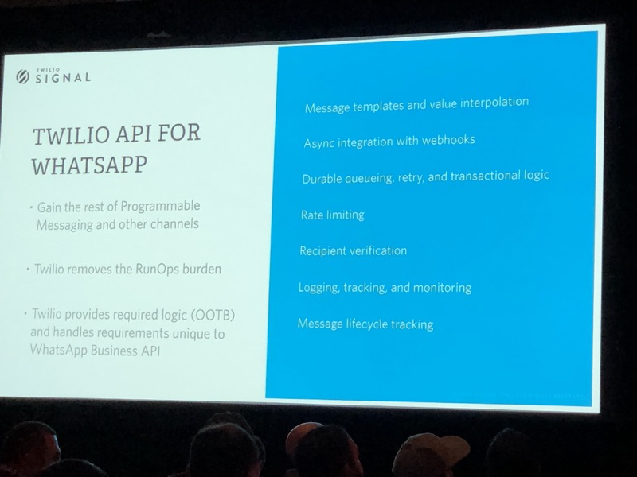

* They (twilio) have positioned themselves as the "_RunOps_" team and one-stop-shop
* Anytime you want to message a user more than once every 24 hours you need to use a pre-approved template
* Whatsapp Ratelimit = 20 MPS and Spike = 60 MPS

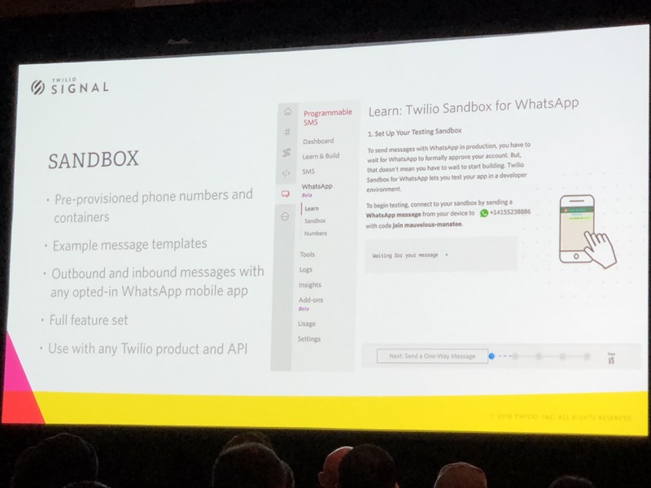

* Sandbox ties in to any product
  * Flex
  * Studio
  * etc...
* Great way to play around with **full features** without charging


* Bringing great tasting food straight to your door
* Goal is to deliver 3 meals a day
* Wanted to work late and not worry about food
* In London was much harder to get better delivery
* Several new hires actually deliver food
* Founded in 2013 & 13 countries & Over 50k partners & over 380 tech staff
* Unique challenge to get food to you in 30 minutes
* 40% of first time orders are through the web
* **Built their whatsapp integration in 2 weeks**
* First time users are 2x more likely to call an order
* Progress trackers are great, but push is good to (polling versus push)
* Why Twilio? → Straightforward, built tested & shipped in 5 days.
  * Already familiar with messaging API
  * Let them focus on the **product** not building to specific APIs
* ~20% of customers opted in to whatsapp
* Now building out 2 way persistent messaging
  * Single channel for customer ↔ Business

[top](#index)

## Grubhub
### [Elisa Bellagamba & Akhil Karanth](https://signal.twilio.com/sessions/GKUYRJzcEeiDzApYClWoBw)


> Grubhub’s Cloud and Infrastructure team will walk you through their approach to solving critical business problems from evaluation to implementation using their Masked Communications project as a case study.

* Contextual communications done right are great (amazon)
* Done poorly
  * I don't want to speak to **ANY** agent
  * Intermediate person rarely adds value
* Instacart solves the problem by provision numbers for each shopper/buyer
* Why Proxy
  * Faster time to deployment
  * Cost savings (fewer phone numbers)
  * Customized Experience


* Operates in a 3 pillar system
  * Diners
  * Restaurants
  * Delivery Partners
* Creates a nice feedback loop
  * Diners making more orders
  * More money to restaurants
  * Need more delivery Partners and make more money
  * Then more variety → More orders, etc...

#### Why communications matter in this model

* Need to make communications as instant as possible
  * No parking, No badge, etc...
* Solution #1 → Sharing Numbers
  * Worked pretty well, but had some issues
  * Not super secure (but contextual)
  * No customer "ease of mind"
  * No control on the customer experience
* Solution #2 → Contact Center as Communication Hub
  * Leverage the IVR for secure communications
* Solution #3 → Build Custom Logic
  * Gruhub would have complete control on masked communications
  * Complex management of phone numbers utilization and masking sessions
  * SMS doesn't have the concept of a "Session" → Very hard to build session management
  * Scaling up requires additional work to provision a larger pool of phone numbers, etc...

#### How Proxy Works

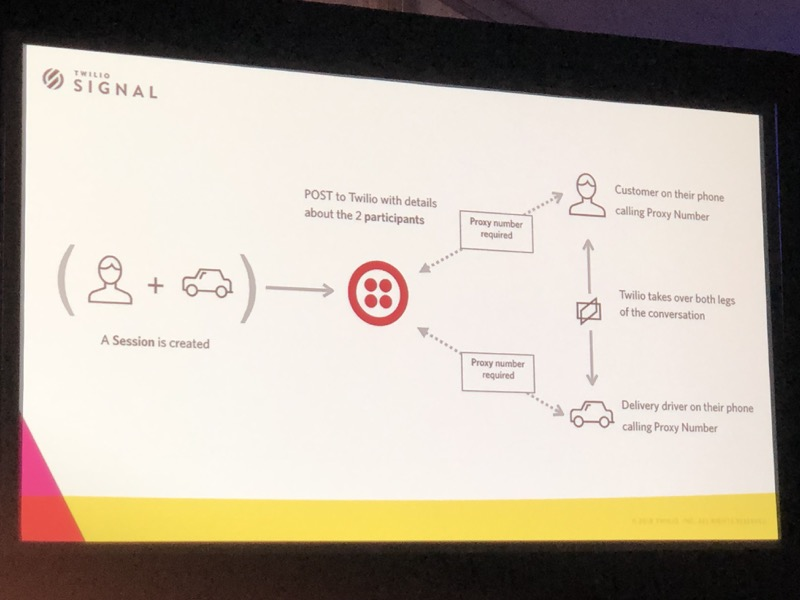

* 4 key objects in Proxy
* Services
  * Phone numbers logically grouped together (country codes, area codes, etc...)
* Sessions
  * Conversations, messages threads
* Participants
  * Users
* Interactions
  * Single SMS or Single Voice call between
  * Gives insight between these interactions
  * Use information to provide a better experience for each user and drivers

#### Proxy @ Grubhub

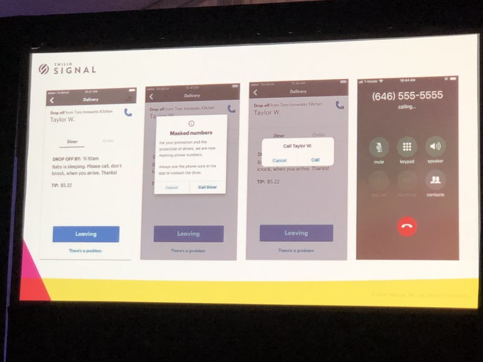

* Display to the users that they're going to use masked phone numbers
* Creates and manages the sessions via the Proxy API
* Set a timeout for the relationship (TTL)
* 9 Lines of Java Code
* Customizing the XP
  * Out of session if someone calls, route to customer care
  * Use country code & area code matching (must buy each one)
* Used in production for over 6 months
* Took 2 weeks to deploy their code
* Lessons learned
  * Monitor everything
    * Proxy API success and failure rate
    * Interaction callback counts (config, interactions working)
    * Phone numbers & number of sessions
  * Plan for failure
    * GrubHub has massive customer care org in the case things fail
  * Be upfront with users
    * let them know whats going on (build trust)

[top](#index)

## SMS at Scale
### [Matthew Holford](https://signal.twilio.com/sessions/TXYvBJzcEeiDzApYClWoBw)


* Non-profit that engages folks over SMS
* At any given point they have a number of different campaigns
* Founded in 1993, 6 million members, every zip code, 100+ countries
* Two main channels:
  * Web
  * SMS (subset that is a complete sms experience)
* Millions of messages per broadcast
* 2x cost of anything else
* Two SMS companies
  * Crisis Text Line
  * Shine Text
* SMS can be weird
  * No UI to design
  * Conversations != screen readers
  * Segmentation are tough
* Dedicated keyword to respond (converts at a higher rate)
* SMS to web works well, so long as the mobile site is mobile friendly
* missing features
  * Broadcast lists
  * Segmentation
  * A/B tests
  * Customer Support
  * conversational flow
  * Systems integration

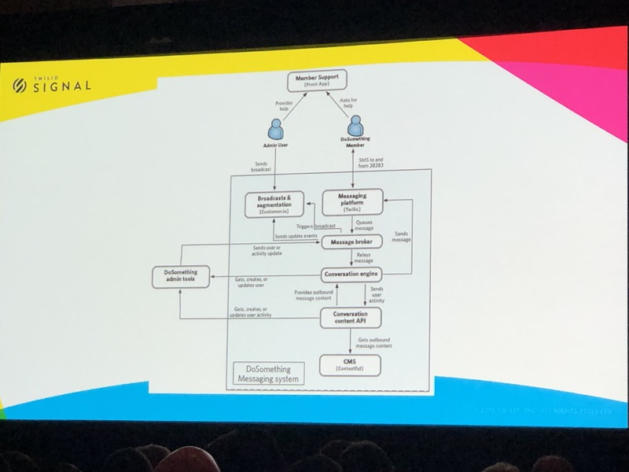

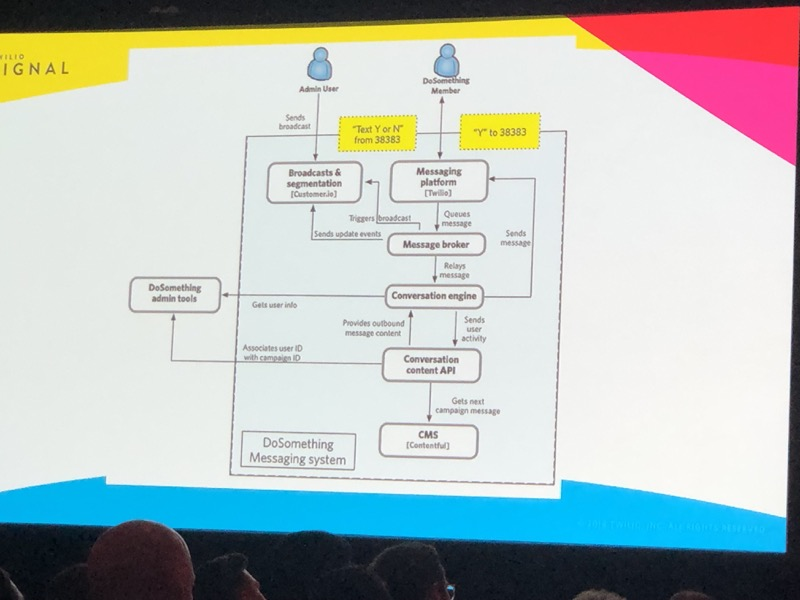

* When someone replies 'y' what did they agree to
* In a distributed system, what are **they** saying yes.
* Working with twilio on what 10s of thousands of error messages mean (edge cases)
* Reduce **DoSomething** software footprint (small team can't manage everything)

[top](#index)

## How we built our Super Network
### [Doug Gardner](https://signal.twilio.com/speakers/uh1kNKDcEeiFEApYClVgDw)

[top](#index)

## Building Phone Verification at Scale
### [Dan Killmer](https://signal.twilio.com/sessions/LEvx9qGbEeiwFwpYClQOHA)

[top](#index)