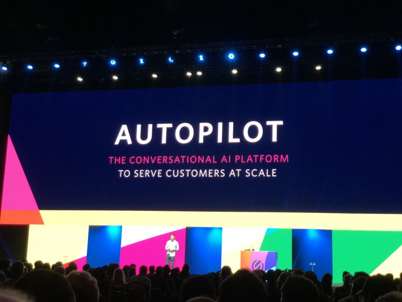

# Signal 2018 Day 1


## Index
* [Day 1 Keynote](#day-1-keynote)
  * [Flex]()
  * [Pay]()
  * [Autopilot]()
* [Target's Guide](#targets-guide)
* [Twilio and Whatsapp](#twilio-and-whatsapp)
* [Grubhub](#grubhub)
* [SMS at Scale](#sms-at-scale)
* [How we built our Super Network](#how-we-built-our-super-network)
* [Building Phone Verification at Scale](#building-phone-verification-at-scale)

## Day 1 Keynote

* Home depot talked to how they're using twilio to manage "Where is my order" style notifications.


* Jeff talks about how APIs democratize the future
  * Nordstrom uses APIs to build communications to connect tailors and stylist
  * Dominos uses Alexa & APIs to wire-up pizza and people


* OpenGov Foundation is working to connect constituents to elected officials
* Average age of Federal Technology is 15 years old
  * Senate voicemail inbox capacity it 300 total voicemails
* Article1 gives the Senate unlimited voicemails
  * Transcribes the voicemails automatically
  * Adds text message to congress
  * When you call, you get an auto-text acknowledging the call
* Want to rebuild the communications systems that connect elected officials


* Twilio quest has racked up over 100 million points
* Twilioquest is expanding and to get more people learning to code
* Now has a cute lil 2D game mode
* Set goals for what Twilio looks like in 2023
  * 50% employees women
  * 30% Under-represented populations


* Business engagement is not going as well as expected
* Internal systems are fighting themselves
* Great experiences when done correctly are memorable (Texting a hotel for lost key (Kipsu))
* Built the [Engagement Cloud](https://www.twilio.com/engagement-cloud)
* Adding to every part of the customer journey
  * marketing
  * Call tracking
  * Alerts
  * Account Verification
  * Payments
  * etc...
* Redfin has started to build out better integrations
* 1800-Flowers
  * Alerts, payments, touch points all drive better CX
  * Use twilio studio to model flows first
  * Saving $ by deflecting calls with proactive notifications
* Fedex Cross Border
  * Mission is to get better at cross-border sales (Global Commerce)
  * Dealing with customs, shipping, etc...
  * How to make notifications realtime in a global landscape
  * Without communications there is no commerce


* Based on the software layer on top of the network
* If they know about an issue, they can route around outages
* Have over 1 trillion datapoints processing
* **Can detect 97% of incidents in realtime**
* All the complexity is managed away
* ISO, CSA, AICPA, GDPR Compliance
* Becoming more difficult to keep track of all the channels
* Channels are not stopping, (RCS & Apple Business Chat)
* **Really pushing the single integration point**


* Sending emails is easy... **delivering** emails is much more difficult
* Sendgrid has a _supernetwork_ of ISPs to avoid SPAM filtering
* High scale & high reliability
* Really talking about trust
* 74,000 companies use sendgrid
* over 1 million developers
* Send about half trillion emails per year

### Flex


* Speed of an app with the flexibility of an API
* **Pushing flex hard**
* "We are stuck with an on-prem install with Professional Services" -or- "We can deploy a SaaS app and we can't change anything"
* Tested with contact centers with 50k agents


* Flex is extended through plugins
* Updates are outside of the continuous updates
* Quick updates w/not a ton of code
* Flex plugin builder based of create-react-app (runs flex locally while building)
* Components are modular and can be moved around
* Relatively rapid A & B testing on call center
* Pricing typical is a per-seat model for a call-center
* Flex can be paid by "Per active user per hour"

[top](#index)

### Pay


* Talk a lot about technology to consumers
* Showcase that the "dominos brand" is easy to use
* What is next for dominos?
  * Customers wanted better pizza tracking methods
  * Push
  * Alexa
  * SMS
* 60%+ of orders are all e-orders
* 30% of orders are over the phone (credit card)
* Moving forward to payments (PCI compliance)


* Twilio now supports `<Pay>` over the phone without forcing _you_ to be PCI compliance.
* Developer toolkit is rapidly expanding
* Increase revenue by reducing friction (convert to payed)
* A new TwiML verb `<Pay>` to get up and running
* Has a Flex Plugin to capture information
* Has voice today, will be bringing to all Channels (Mobile payment (apple/google))

#### Sample TwiML for `<Pay>`

```xml
<?xml version="1.0" encoding="UTF-8"?>
<Response>
    <Say> Welcome to kickflip boards</Say>
    <Pay chargeAmount="59.99" action="{url}"/>
</Response>
```

### Autopilot



* Need a new type of tool for bots to exceed
* Needs to be conversational, omnichannel, NLP support
* The future is still conversational... we have been reacting to how computers work, we want to force computers to adapt to us.
* Autopilot Actions
  * `{Say}` → Speak
  * `{Show}` → Display
  * `{Remember}` → Keep for context
  * `{Collect}` → _web_ form style get information
    *
  * `{Handoff}` → Send to agent

[top](#index)

## Target's Guide
### [Josh Hoium](https://signal.twilio.com/speakers/hD5G-MQxEei3-gpYClQEBw)

[top](#index)

## Twilio and Whatsapp
### [Rahma Javed & Anne Byrne](https://signal.twilio.com/sessions/KeMDqpzcEeiHpQpYClWZDA)

[top](#index)

## Grubhub
### [Elisa Bellagamba & Akhil Karanth](https://signal.twilio.com/sessions/GKUYRJzcEeiDzApYClWoBw)

[top](#index)

## SMS at Scale
### [Matthew Holford](https://signal.twilio.com/sessions/TXYvBJzcEeiDzApYClWoBw)

[top](#index)

## How we built our Super Network
### [Doug Gardner](https://signal.twilio.com/speakers/uh1kNKDcEeiFEApYClVgDw)

[top](#index)

## Building Phone Verification at Scale
### [Dan Killmer](https://signal.twilio.com/sessions/LEvx9qGbEeiwFwpYClQOHA)

[top](#index)