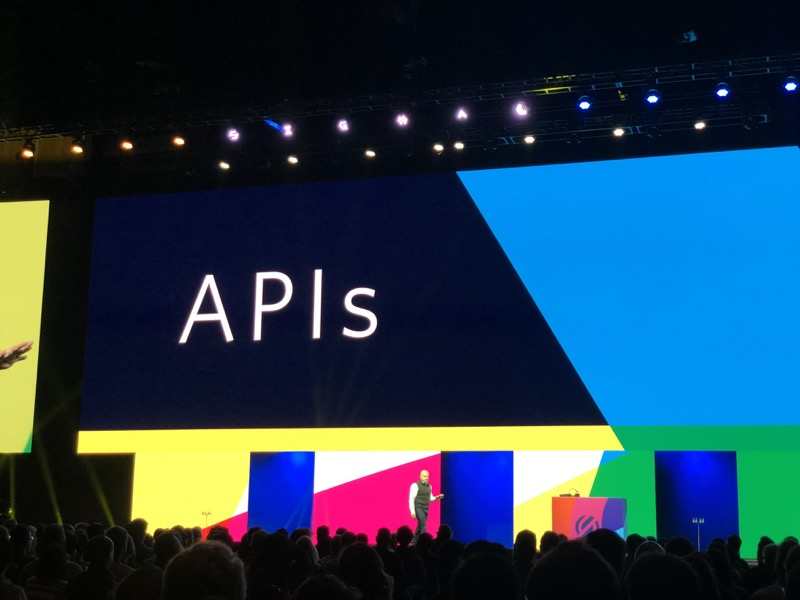

# Signal 2018 Day 1

## Index
* [Day 1 Keynote](#day-1-keynote)
* [Target's Guide](#targets-guide)
* [Twilio and Whatsapp](#twilio-and-whatsapp)
* [Grubhub](#grubhub)
* [SMS at Scale](#sms-at-scale)
* [How we built our Super Network](#how-we-built-our-super-network)
* [Building Phone Verification at Scale](#building-phone-verification-at-scale)

## Day 1 Keynote

* Home depot talked to how they're using twilio to manage "Where is my order" style notifications.

* Jeff talks about how APIs democratize the future
 * Nordstrom uses APIs to build communications to connect tailors and stylist
 * Dominos uses Alexa & APIs to wire-up pizza and people

* OpenGov Foundation is working to connect constituents to elected officials
* Average age of Federal Technology is 15 years old
 * Senate voicemail inbox capacity it 300 total voicemails
* Article1 gives the Senate unlimited voicemails
 * Transcribes the voicemails automatically
 * Adds text message to congress
 * When you call, you get an auto-text acknowledging the call
* Want to rebuild the communications systems that connect elected officials

## Target's Guide
### [Josh Hoium](https://signal.twilio.com/speakers/hD5G-MQxEei3-gpYClQEBw)

[top](#index)

## Twilio and Whatsapp
### [Rahma Javed & Anne Byrne](https://signal.twilio.com/sessions/KeMDqpzcEeiHpQpYClWZDA)

[top](#index)

## Grubhub
### [Elisa Bellagamba & Akhil Karanth](https://signal.twilio.com/sessions/GKUYRJzcEeiDzApYClWoBw)

[top](#index)

## SMS at Scale
### [Matthew Holford](https://signal.twilio.com/sessions/TXYvBJzcEeiDzApYClWoBw)

[top](#index)

## How we built our Super Network
### [Doug Gardner](https://signal.twilio.com/speakers/uh1kNKDcEeiFEApYClVgDw)

[top](#index)

## Building Phone Verification at Scale
### [Dan Killmer](https://signal.twilio.com/sessions/LEvx9qGbEeiwFwpYClQOHA)

[top](#index)