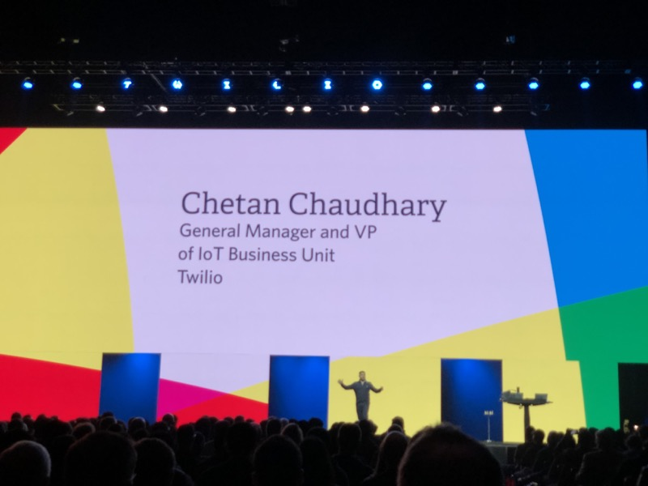
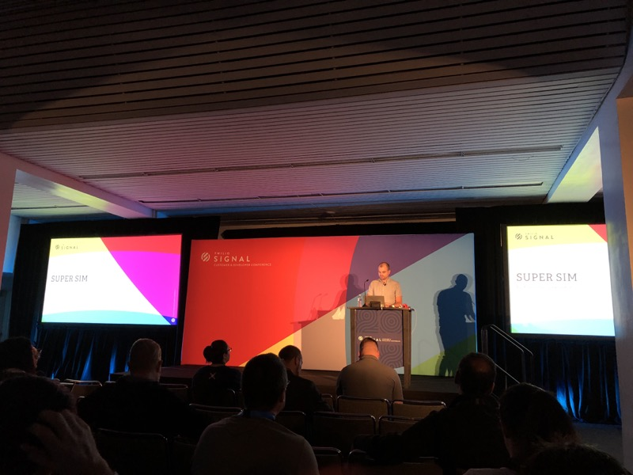
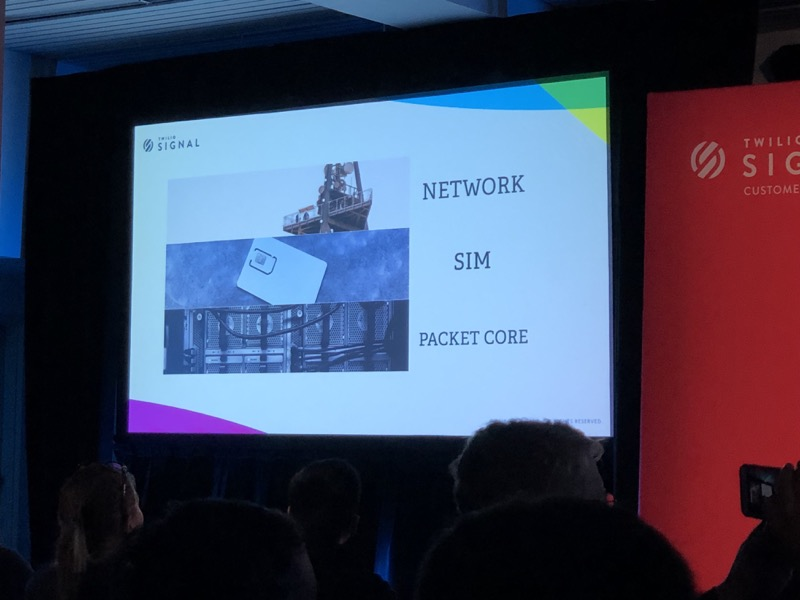
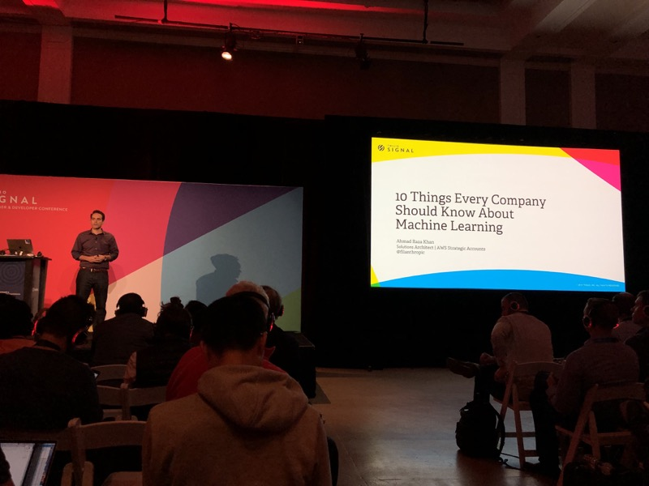
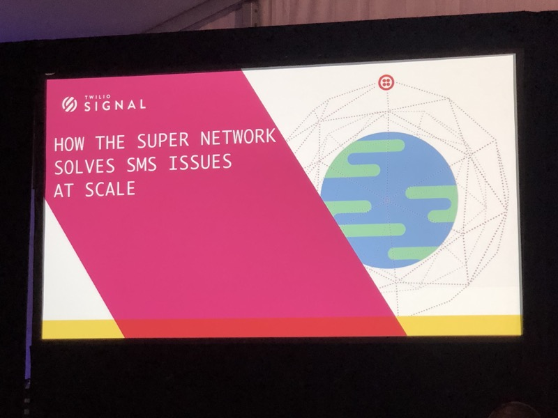

# Signal 2018 Day 2

## Index
* [Day 2 Keynote](#day-2-keynote)
* [Introducing the Twilio Super SIM](#introducing-the-twilio-super-sim)
* [10 Things Every Company Should Know About Machine Learning](#things-every-company-should-know-about-machine-learning)
* [How the Super Network Solves SMS Issues at Scale](#how-the-super-network-solves-sms-issues-at-scale)
* [Delight Future Customers with Outbound Marketing](#delight-future-customers-with-outbound-marketing)
* [Lessons Learned from 1,000 Bots](#lessons-learned-from-bots)
* [The Hard Fought Battle of Production Machine Learning](#the-hard-fought-battle-of-production-machine-learning)

## Day 2 Keynote

* Twilio.org sent over 1 billion messages over the past 5 years & pledging to reach 1 billion people each year

* Wireless enabling shipping tracking
* Lime, Scoot, Spin, Bird all using Twilio SIM
* Smart home devices are taking off b/c cheap, easy, and universal
* Benefit versus expense hard to justify for IoT devices outside the home
* Twilio announcing the "Super SIM"
* Single SIM, Single API, Single Bill for global reach
* Partnering with T-mobile, Telefonica (SA), 3 (EU), Singtel (Asia)
* Lots of devices don't really need lots of data. Trade off data for cost and power savings
* NarrowBand solves **mass** deployment
  * One-off Hardware Costs → $20 today to $5 next year
  * Connectivity Cost going from months to years/decades
  * Battery Life → 2AA Batteries **could** last 10 years
* Twilio & Tmobile Launching narrowband network

[top](#index)

## Introducing the Twilio Super SIM
### [Andrew Jordan](https://signal.twilio.com/sessions/nRPgupzcEeiDzApYClWoBw)

> The IoT connectivity market is maturing quickly to support both high and low consumption devices. These categories are frequently referred to as Critical IoT (low latency, high throughput), and Massive IoT (high latency, low throughput). Join this session to learn how Twilio is solving for both Critical and Massive IoT with new Programmable Wireless offerings.

* IoT is hard (especially if hardware is hard)
* Iot Deployment stack doesn't really exist
  * Hardware is unique
  * Manufacturing costs
  * Different connectivity options
* When things get global, these problems compound
* Super SIM makes global connectivity easy
  * No such thing as regional deployments
  * Supports special uses cases
  * Debugging IoT can be **really hard**

* Wireless Super Network
  * Same approach that Twilio has used for SMS & Voice
  * Super as in "superset"
  * Managed by Twilio to optimize for coverage, latency, & cost
  * T-mobile, Telefonica, 3, Singtel
* Network Redundancy
  * Engineered for availability and fault tolerance
  * Diversity in interconnect locations and IPX providers
* One SIM, all the radio tech
  * 2G/3G/LTE (existing)
  * LTE CAT-M1 (existing)
  * Narrowband (future)
  * 5G (future)
* A bit about SIM
  * 5mhz processor
  * Very well specified (most people actually follow this spec!)
  * Runs _Java Card_
* Embedded SIM
  * MFF2 form factor
  * Soldered directly onto the board at time of manufacture
  * Smaller and more durable than replacement SIMs
* eSIM
  * eSIM is a solution designed by the GSMA for over the air management of SIM profiles
  * eSIM is **not** a form factor and is compatible with all SIM form factors
  * IMSI, Ki, Kc, etc... are all swapped over the air
* Multi IMSI
  * IMSI - international mobile subscriber identity
  * Switching logic implemented on the SIM via an applet
  * IMSI switch triggered on region change
  * Same auth keys and core for every parallel
* Embedded, eSIM compatible, Multi IMSI SIM
  * Embedded is the form factor (MFF2)
  * eSIM compatible allows for OTA updates
* Super SIM available as removable or embedded SIM
* OTA platform for super SIM
  * updates for the multi IMSI applet tables
  * Allows adding of new IMSIs
  * Keep fleet up to date with latest optimizations
  * Supports SMS and HTTP protocols
* Pure software mobile core (AWS)
  * deployed in various datacenters
* Software Mobile core unlocks innovation
  * Each time they deploy software the mobile core gets better
  * On track for over 1k deployments this year
  * Complete visibility for network attachments and data flow (gives developer as much visibility throughout the stack)
* Working define a network access list to whitelist & blacklist (at a group level)

[top](#index)

## Things Every Company Should Know About Machine Learning
### [Ahmad Khan](https://signal.twilio.com/sessions/zaARAJzbEeiTGQpYClWbCg)

> Artificial Intelligence (AI) and its most popular subfield, Machine Learning (ML), is all the rage these days. Futurists predict that every facet of our lives and every line of business is going to be transformed by ML. In this talk, we will focus on some of the key insights that every developer should know about ML. Theses insights will range from some of the key ML tools to some of the common fallacies and lessons learned related to the ML process. This is a high-level talk so no matter what your expertise level, you will likely walk away with some amount of learning.

#### Context

* APs twitter account gets hacked in 2013 (tweets about Explosions and Obama injured (fake))
* Deep learning a subset of machine learning which is a subset of Artificial Intelligence
* Supervised vs Unsupervised
  * Supervised: predict a price of a house with linear regression.
    * "beds, baths" are features
    * Price is the label
  * Unsupervised: Using clustering to do segmentation
    * Only have features (no labels)
    * Selling to a broad audience, which segment is buying your products (don't need labels)
* Deep Neural Network
  * Deep versus not: just the 'hidden layers'
  * A neural network that has two or more hidden layers is considered 'deep'
* Reinforcement Learning
  * At a high level, the environment provides the 'agent (ML)' some sort of state
  * based on the action of the agent, the state will change.
  * Reward a 'point' and it becomes the next state
* Traditional Programming
  * Takes an algorithm & data to a computer and drives the output
* Machine Learning
  * Training algorithm & historical data go into machine... New data processing in machine
* Advanced algorithm, data, hardware make this time prime for explosion
  * Companies have been saving data for the past years and years
* No data, no learning: "Data is Key"

#### Key points

* #1: data is gold
  * Automation vs Augmentation: some sort of graph where humans vs machine
* #2: Automations vs Augmentation
  * Not every problem is well-suited for ML
  * Problems with lots of **good quality** historical data - automate
  * AI / Human Hybrid Solution?
* #3: No general purpose intelligence
  * You need to build a specific model for every specific problem
    * Why is customer calling?
    * What does the image contain?
    * What are people saying about me on social media?
    * Is this customer likely to make a purchase?
* #4: Data quality matters
  * Garbage in → Garbage out
  * Data should contain "learnable" patterns
* #5: Use fine-tuning / transfer learning
  * Take existing models and fine-tune
  * Most problems can be solved successfully using stat learning models
* #6: Feature engineering is key
  * Look for attributes that make the data richer
  * Image & text is converted to some form of numerical representation in Neural Networks
  * Example: Predicting seasonal sales
    * Timestamp: `2017-09-29T20:45:40Z` has Time-of-day **and** season
* #7: Invest in custom models for competitive differentiation
  * Most low-hanging fruits can be had by using a cloud API
  * Consider long-term cost
  * Invest in custom model development if you have data no one else has access
* #8: Choose the framework best for your use-case
  * Look at language support, community support, visualization, distributed execution, & portability
  * Start with higher-level framework such as Keras, Gluon or PyTorch
  * Python is most widely supported programming language
* #9: Consider re-training devs rather than hiring data Scientist
  * Data Scientist ares super $
  * Developers can be retrained to write custom models
  * Developers with a background in math & science will have an edge
* #10: Learn and be curious
  * Lots of resources
    * [fast.ai](fast.ai)
    * Andrew Ng's deep learning class on coursera.com
    * [gluon.mxnet.io](gloun.mxnet.io)

[top](#index)

## How the Super Network Solves SMS Issues at Scale
### [Lee Humby](https://signal.twilio.com/sessions/DnPrgqGdEeiJLApYClWbEg)

> The global SMS network can be an unforgiving place at times. Routes can go down because of carrier outages, messages can get delayed and even dropped completely, and local regulations can change at the drop of a hat. Detecting these issues before they affect your customers can be extremely challenging. In this session, you’ll hear about the systems and processes the Twilio Super Network uses to proactively detect and solve SMS deliverability issues to ensure our customers can always deliver their business-critical messages.

* Previously: Needed SMPP know-how, SMSC, domain specific knowledge
* Now, Just need a credit card and web app
* Messages can fail to arrive for various reasons and all lead to bad use-cases
* Delivery receipts aren't reliable; local regulations changing
* DLRS are intended to confirm when an SMS is received successfully at the destination handset, but in practice they don't tell the whole story
* DLRs
  * Networks only acknowledge received not device
  * Fake DLRs: generate fake successful DLRs to prevent gaming
* Sender IDs
  * Alphanumeric, Local Numbers, Non-local Numbers, Short Codes, Pre-registered sender IDs
  * Not all operators support each senderId type
  * Sometimes sender IDs are overwritten to comply with regulations
  * Co-Pilot helps fix some of the oddness
  * Global issues are difficult to navigate
* Concatenation
  * < 160 characters or 70 characters
  * Data headers help re-build the data
* Character Encoding
  * Different encoding standards
  * `@` symbol in Latin-1 is `¡`
* Global Regulations are difficult

[top](#index)

## Delight Future Customers with Outbound Marketing
### [Guillaume Cabane](https://signal.twilio.com/sessions/rDNZsLMtEeidLgpYClQbBA)

> If you think marketing is a horrible be necessary evil, you're right. And outbound campaigns are the worse example of bad marketing. Massive and not relevant for most people. But it doesn't have to be that way. For B2B SaaS, we can now tell who's in the market for a specific product. We can use 3rd party intent data and machine learning predictions to create delightful marketing. Outbound messages that bring value to your prospects, or even better, delight.

[top](#index)

## Lessons Learned from Bots
### [Chloe Condon & Bear Douglas](https://signal.twilio.com/sessions/isioZJzcEeiDzApYClWoBw)

> In the two years since Slack launched its platform, over 1,000 bots and apps have been listed in its App Directory. In this talk, we’ll cover what we’ve seen makes bots successful, including case studies about: -Elements of good onboarding -How A/B testing your words can pay major dividends -How blending chat-based UI and interactive elements can boost engagement -An example from Sentry.io

[top](#index)

## The Hard Fought Battle of Production Machine Learning
### [Sam Phippen](https://signal.twilio.com/sessions/QDgJrqGeEeiGVQpYClWoDg)

> It's not uncommon, you have a problem where you finally need machine learning. You've got a great data science team. They come up with something, and put it out there, and then 6 month's later it's a broken down mess. We love our data science friends, but it's not their job to build great production software. As engineers, it's ours. In this talk, we'll go through the story of DigitalOcean's fraud prevention tooling, lovingly dubbed "sketchy". You'll learn about it's origin, our first attempt at using machine learning, and how we've come up with practical production machine learning strategies. You'll find out more about "standard" site reliability techniques, as well as how we change some of them for our ML work. This talk includes practical tips for everyone, but is best for those who have some experience operating production software.

[top](#index)
