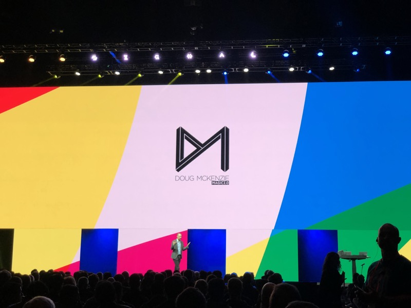

# Signal 2018 Day 2

## Index
* [Day 2 Keynote](#day-2-keynote)
* [Introducing the Twilio Super SIM](#introducing-the-twilio-super-sim)
* [Connect Every Thing](#connect-every-thing)
* [How the Super Network Solves SMS Issues at Scale](#how-the-super-network-solves-sms-issues-at-scale)
* [Delight Future Customers with Outbound Marketing](#delight-future-customers-with-outbound-marketing)
* [Lessons Learned from 1,000 Bots](#lessons-learned-from-bots)
* [Setting Your Users Up for Success With Twilio Video](#setting-your-users-up-for-success-with-twilio-video)
* [The Hard Fought Battle of Production Machine Learning](#the-hard-fought-battle-of-production-machine-learning)

## Day 2 Keynote

[top](#index)

## Introducing the Twilio Super SIM
###

[top](#index)

## Connect Every Thing
###

[top](#index)

## How the Super Network Solves SMS Issues at Scale
###

[top](#index)

## Delight Future Customers with Outbound Marketing
###

[top](#index)

## Lessons Learned from Bots
###

[top](#index)

## Setting Your Users Up for Success With Twilio Video
###

[top](#index)

## The Hard Fought Battle of Production Machine Learning
###

[top](#index)
