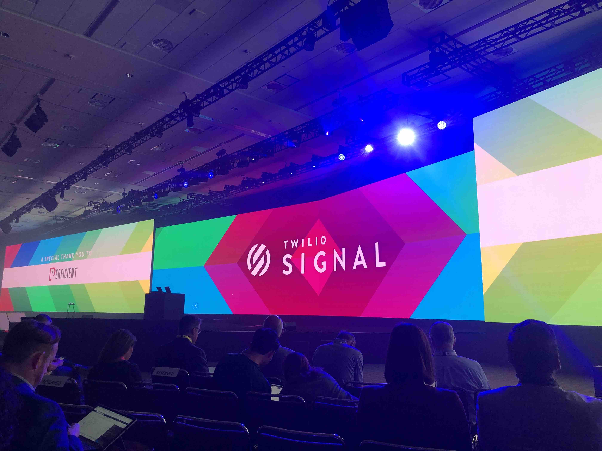
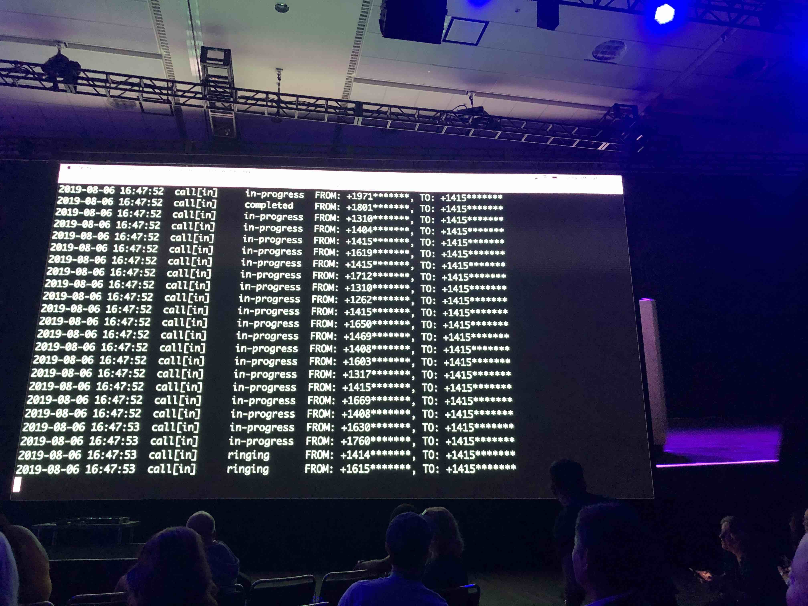

# Signal 2019 Day 1

## Index
* [Day 1 Keynote](#day-1-keynote)
* [What can you do with Programmable Voice?](#What-can-you-do-with-programmable-Voice)
* [Programmable Voice announcement](#programmable-voice-announcement)
* [Twilio CLI](#twilio-cli)
* [Twilio CLI Workshop](#twilio-cli-workshop)
* [answering machine detection](#answering-machine-detection)
* [Freshcaller](#freshcaller)
* [BYOC](#BYOC)
* [SIP customers](#sip-customers)

## Day 1 Keynote

* 32.5k concurrent/second
* 13k messages/second
* 3 Billion email addresses (half of all email addresses)
* Run superclass into the enterprise and work with companies specifically for internal education

### How netflix uses Twilio

* Use Twilio for SMS
* Twilio for augmenting toll-free number capabilities globally (190 countries)
* Built a "message builder" service to be omnichannel and agnostic of channel.
* Password reset over sms
* Text message to mobile phone for low friction TV sign up

### Production Releases 2019

#### Starting in 2020 they will begin signing BAA

* They released to production 125k times
* Twilio Pay GA
* Twilio recording encryption GA
* Twilio for salesforce GA
* A lot from their customers in Health Care Space
* HIPAA and BAAs

[top](#index)

### Developer Experience

#### Releasing Twilio CLI

* Everyone starts mostly the same way... IDE and phone
* Then Search for docs, console, etc...
* Want less complexity & be able to streamline
* New way to create and manage twilio applications
* Bundle functionality
  * Private plugins
* Integrated webserver within the CLI (🔑 ? )

[top](#index)

### Customer Engagement

* One engagement platform for all channels in critical
  * Helps them move quickly
* Drive more Interactions
* Connect the Journey (journey is your brand)
* Create lasting Relationships

## SendGrid

* **Email validation API** Uses machine learning to determine if the email is valid before sending
* **Marketing campaign management**
* **Ads** in private beta (Facebook, instagram, google) all managed from single UI (tracked by email address)

## Flex

* Legacy on-prem providers: Avaya, Genesys
  * Not flexible and not built for continuous improvement
* Shopify was able to get to MVP in 4 weeks (4 months to production)
* Lyft
  * Support driver and rider, specific contact center
  * The customizable interface with a single tool great for agent efficiency
  * Saving 1 second over 1 million interactions
* Media stream API
  * Real time media access to the call
  * Real time transcriptions
  * Conversation analytics
* New verb `<Start>`
  * `<stream>` where to send media via WSS or SIP

## What can you do with Programmable Voice?

[top](#index)

## Programmable Voice announcement

[top](#index)

## Twilio CLI

[top](#index)

## Twilio CLI Workshop

[top](#index)

## answering machine detection

[top](#index)

## Freshcaller

[top](#index)

## BYOC

[top](#index)

## SIP Customers

[top](#index)
