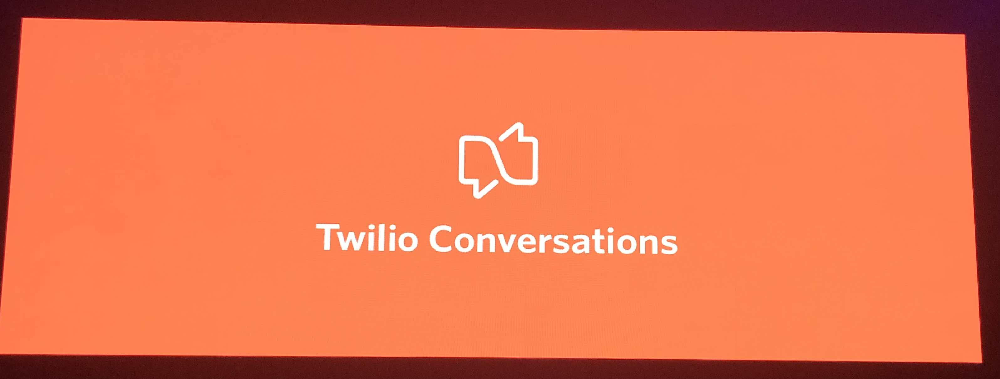

# Signal 2019 Day 1

## Index
* [Day 1 Keynote](#day-1-keynote)
* [Media Streams](#media-streams)
* [Twilio CLI](#twilio-cli)
* [Calling all APIs](#calling-all-apis)
* [answering machine detection](#answering-machine-detection)
* [Stripe and Twilio](#stripe-and-twilio)
* [BYOC](#BYOC)
* [SIP customers](#sip-customers)

## Day 1 Keynote

* 32.5k concurrent/second
* 13k messages/second
* 3 Billion email addresses (half of all email addresses)
* Run superclass into the enterprise and work with companies specifically for internal education
* **75% of all Twilio SMS numbers are not configured for inbound SMS**

### How netflix uses Twilio

* Use Twilio for SMS
* Twilio for augmenting toll-free number capabilities globally (190 countries)
* Built a "message builder" service to be omnichannel and agnostic of channel.
* Password reset over sms
* Text message to mobile phone for low friction TV sign up

### Production Releases 2019

#### Starting in 2020 they will begin signing BAA

* They released to production 125k times
* Twilio Pay GA
* Twilio recording encryption GA
* Twilio for salesforce GA
* A lot from their customers in Health Care Space
* HIPAA and BAAs

[top](#index)

### Developer Experience

#### Releasing Twilio CLI

* Everyone starts mostly the same way... IDE and phone
* Then Search for docs, console, etc...
* Want less complexity & be able to streamline
* New way to create and manage twilio applications
* Bundle functionality
  * Private plugins
* Integrated webserver within the CLI (🔑 ? )

[top](#index)

### Customer Engagement

* One engagement platform for all channels in critical
  * Helps them move quickly
* Drive more Interactions
* Connect the Journey (journey is your brand)
* Create lasting Relationships

[top](#index)

## SendGrid

* **Email validation API** Uses machine learning to determine if the email is valid before sending
* **Marketing campaign management**
* **Ads** in private beta (Facebook, instagram, google) all managed from single UI (tracked by email address)

## Flex

* Legacy on-prem providers: Avaya, Genesys
  * Not flexible and not built for continuous improvement
* Shopify was able to get to MVP in 4 weeks (4 months to production)
* Lyft
  * Support driver and rider, specific contact center
  * The customizable interface with a single tool great for agent efficiency
  * Saving 1 second over 1 million interactions
* Media stream API
  * Real time media access to the call
  * Real time transcriptions
  * Conversation analytics
* New verb `<Start>`
  * `<stream>` where to send media via WSS or SIP

[top](#index)

### What's Next - Era of Conversations

* When companies started leveraging Whatsapp they got 53% response rate
* Time to start listening to customers on their channel
* "Conversations are eating apps"
  * It's easy for the customer, there's nothing to download. (app fatigue)
  * "BYOD" (bring your own device). Workers are no longer tied to desk and are using their own cell phone
  * Follows natural behavior. Already texting our friends
* Apple Business Chat, Whatsapp, Facebook Messenger
* RCS - Biggest upgrade to SMS in 40 years of messaging

### Messaging - Twilio Conversations

* Conversational messaging isn't _quite_ happening yet
* Customers are no longer on hold... lowers resolution times
* When a conversational interface exists 70-80% have a much better perception of the brand
* Morgan Stanley has added conversations to great success.
* Mentioned Group messaging
* You have to support every channel of choice... Have to bring up each channel:
  * SMS, Whatsapp, Chat
  * Group Messaging
  * Cross-channel orchestration
  * Participant management
  * Message logging & history
* Maintain everything and message state in the API
* No backend required, messages and media flow between the two auto-magically

[top](#index)

## Media Streams

* Gives you real time access to the media that's happening on the call
* Real time transcriptions
* Voice biometrics & Sentiment Analysis
  * works across languages
* It's a media fork instead of a 1 way stream
* Realtime versus Post-call analytics (proactive instead of reactive)
* Up to 4 forks
* [**Globo**](https://www.globo.com) talking about how Media Streams helps them
* Detect background noise to help isolate where the issues are occurring

### Connectors

* Plug and play and get the results back
* [Gridspace](https://www.gridspace.com) - Media streams & connectors
  * What and how things are said in realtime... Anyone working with voice can use Gridspace today
  * Build some query language to match semantic meanings

[top](#index)

## Twilio CLI

* Entirely OSS
* Started with the Dashboard & Console
  * Or through APIs
* All Twilio APIs as commands
  * Phone number management
* Ngrok built in
* Tailing the logs
* Command autocomplete built in
* Plugin framework (accept pull requests)
* Based on ['oclif'](https://github.com/oclif/oclif) open source CLI project
* Using the Twilio-CLI as part of a build script (CI)
* Really focusing on the first touch developer experience
* Hard to see a ton of value for those that aren't constantly using Twilio

[top](#index)

## Calling all APIs

* It's a demo for RapidAPI
* API market on track to be 2.5 trillion
* building a ride-sharing app with Stripe, Maps, Twilio, etc...
  * Rapid-API combines all the APIs as a singular endpoint
* API Marketplace
  * Single API key, single dashboard, etc...

[top](#index)

## answering machine detection

* Automated calling problem
  * Only 24% of un-id'd calls are answers
* Customers are not answering calls, even if they have value
* When calls are answered, how do you make that XP better?
* AMD will will inform your application whether a human, machine, or fax answered the call.
* Three primary segments
  1. Alerts and notifications
  2. Outbound IVR (product survey)
  3. Outbound sales (insurance)
* Twilio AMD is now in v3
* Learned that AMD is a critical tool for many calling use-cases
* First gen didn't meet the bar. Unreliable & few controls
* Wasn't really understood when it was black boxed... customers wanted to learn how it works and what works.
* Previously not a good way to view AMD performance
* AMD now has a few new parameters:
  * Threshold
  * Speech end threshold
* AMD today is that no action can be done during detection
* "Background" AMD... outbound call put into conference, while AMD agent is processing, the other participant that's in the conference is playing twiml.
  * If human, conference an agent in, they can hear the twiml and can seemlessly pickup
  * If machine, interrupt the audio and play from there.
* Moving forward
  * Roadmap driven by customer feedback
  * Mediastreams beta is similar in vain to AMD

[top](#index)

## Stripe and Twilio

* `<Pay>` allows PCI compliant transactions
* [inboxhealth](https://inboxhealth.com) uses these together to assist with healthcare payments
* Nothing too new from last year in the demo except GA
* For those wanting to collect payments over the phone, relatively straight forward implementation

[top](#index)

## BYOC

* Why BYOC
  * Not always ready to change PSTN provider
  * Wanted twilio API and their super network
* Why Not switch?
  * Porting numbers can be risky
  * Longstanding relationships with Tier-1 Carriers
  * Infrastructure investments
  * Different carriers throughout the world
  * not ready for the cloud

* BYOC models
  1. Connection on prem SBC
  2. Direct connection to BYOC provider

* Dial now has `<dial byoc=BYXXXX>{TN}</dial>`
* Console will be adjusted to update
* All of the SIP products will be under the same "product" group

[top](#index)

## SIP Customers

[top](#index)
