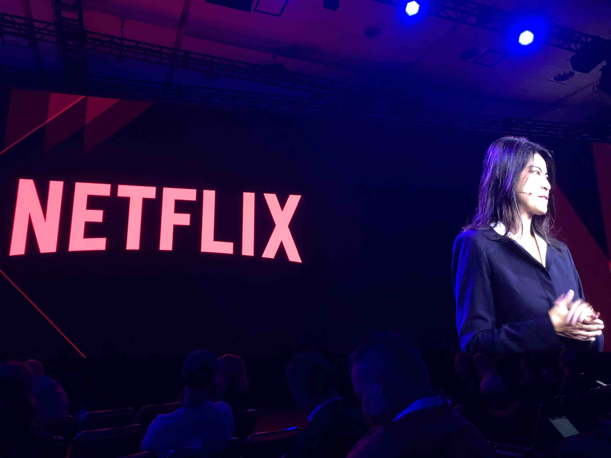

# Signal 2019 Day 1

## Index
* [Day 1 Keynote](#day-1-keynote)
* [What can you do with Programmable Voice?](#What-can-you-do-with-programmable-Voice)
* [Programmable Voice announcement](#programmable-voice-announcement)
* [Twilio CLI](#twilio-cli)
* [Twilio CLI Workshop](#twilio-cli-workshop)
* [answering machine detection](#answering-machine-detection)
* [Freshcaller](#freshcaller)
* [BYOC](#BYOC)
* [SIP customers](#sip-customers)

## Day 1 Keynote

* 32.5k concurrent/second
* 13k messages/second
* 3 Billion email addresses (half of all email addresses)
* Run superclass into the enterprise and work with companies specifically for internal education

### How netflix uses Twilio

* Use Twilio for SMS
* Twilio for augmenting toll-free number capabilities globally (190 countries)
* Built a "message builder" service to be omnichannel and agnostic of channel.
* Password reset over sms
* Text message to mobile phone for low friction TV sign up

[top](#index)

## What can you do with Programmable Voice?

[top](#index)

## Programmable Voice announcement

[top](#index)

## Twilio CLI

[top](#index)

## Twilio CLI Workshop

[top](#index)

## answering machine detection

[top](#index)

## Freshcaller

[top](#index)

## BYOC

[top](#index)

## SIP Customers

[top](#index)
