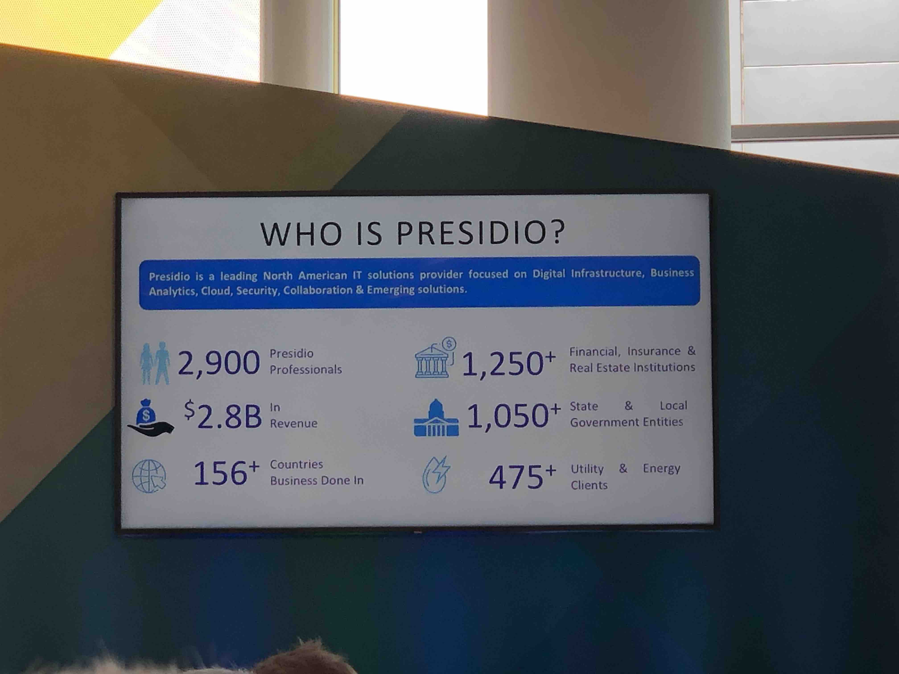
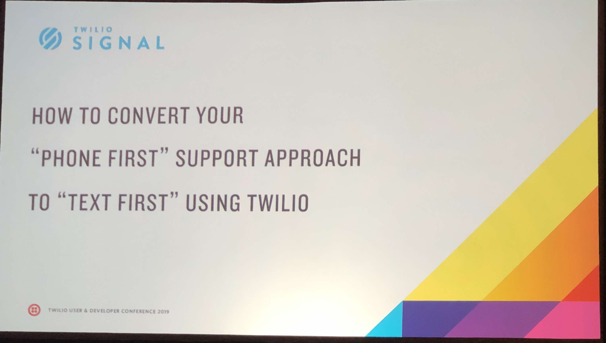

# Signal 2019 Day 2

## Index
* [Day 2 Keynote](#day-2-keynote)
* [Presidio](#presidio)
* [Texting First](#texting-first)
* [verified calls](#verified-calls)
* [Twilio Interconnect](#twilio-interconnect)

## Day 2 Keynote

### Twilio.org

* 3.5k organizations using twilio for non-profits
  * 2018: 25million people assisted via those non-profits
  * 2019: 100million people assisted via those non-profits
* Launching _Crisis Response and prevention initiative_
* Launching _Crisis Response Technology Network_
  * Network to share technological challenges & solutions
* $5million funding to crisis response organizations
* 1% of company equity put towards twilio.org

[top](#index)

### Customer Engagement Platform

* Super network = Phone numbers, short codes, SIP, etc...
* Channel APIs = SMS, chat, email, leverage the super network
* Service layer = They write the code for your
  * Identity, Intelligence, Interactions
* App Platform = Marketing & Flex
* Runtime = Tools to make it possible

[top](#index)

### Trusted Communications - Verified by Twilio

#### Overview

* Generally speaking, most people don't answer calls
* 75% of calls are unanswered when caller is unknown
* 48 billion robo-calls 🤖 in the USA
* $5 Average cost of outbound call from call-center
* Carriers working on protocols to verify calls

#### How it works

* displays message and logo
* Create business profile = vetted and profiled by twilio
* Verifies phone number is owned by company, that there is an API call driving it, and company is verified in order to display the logo.
* Give reason for placing call
* When call rings the reasoning and logo and etc... are displayed on device
* Parter with YouMail, hiya
* Works through an app
* Best guess:  it works via an installed app like robo killer or something else… where you have your native mobile number set to forward to a proxy number that then looks up who is calling. Then forwards the call back to your cell device.
  * Needs 'diversion' information from the network to successfully operate
  * Also forwards **all** incoming calls through a 3rd party

### IoT

* TL;DW Scooters are taking over
* Rently getting a shoutout
* Opening the "black box" of carrier connectivity with Super SIM
* Aruba (HP company) runs wifi networks for stadiums, hospitals, etc...
* Running IoT workshops with Azure & IoT hackpacks
* Narrowband IoT scaling out with commercial partner [Sensoneo](https://sensoneo.com)

[top](#index)

## Presidio

* Why Cloud?
  * They want to put out new features
  * Competing with larger digital companies
* Why Flex?
  * Highest level of programmability and customization in the industry
  * Talk to their customers about twilio flex
  * $5.7B USD spent on on-prem PBX
* Migration Challenges
  * Don't want contact center isolated
  * Still need e911
  * Agent retraining cost
* Fix
  * Used a phased migration
  * CC Isolation (use programmable SIP)
    * Probably can combine network bridge (BYOC) with Flex
* Can you integrate flex into a PBX
  * Flex has their API
  * On-prem PBX has JTAPI & TAPI SDK
  * Teams & Skype has elementary SDK
* Leveraging task router
* Overall impressive integration with everything. But can imagine it's a bit fragile.

[top](#index)

## Texting First

* Phone, email, chat all have issues
  * Phone is time consuming and people don't answer calls
  * Email is relatively slow and SPAM issues
  * Chat is great for one-and-done but not continuous support
* [Precision Services](https://www.precisiontv.com) manages their support queue via Twilio
  * Ran into labor cost issues
  * Discovered that texting the clients got better response than outbound call scheduling
  * Use the Twilio TN lookup API
* Respond to all MMS and other means of communications
* Offer SMS routes to customers in a Queue for over 1 minute

[top](#index)

## verified calls

* How it works
  1. Customer provides business and brand info to twilio
  2. twilio validates business profile
  3. Customer associates branding set with phone numbers
* YouMail, CallApp, Hiya, RoboKiller

[top](#index)

