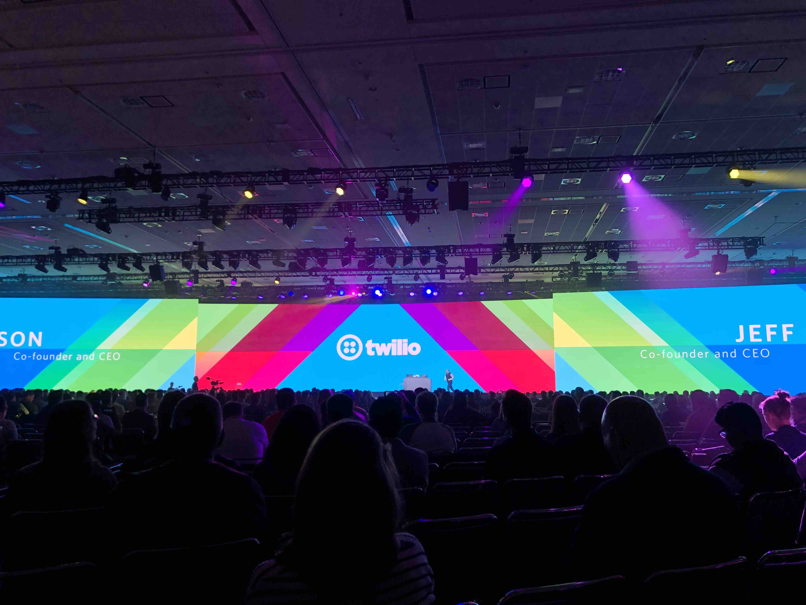
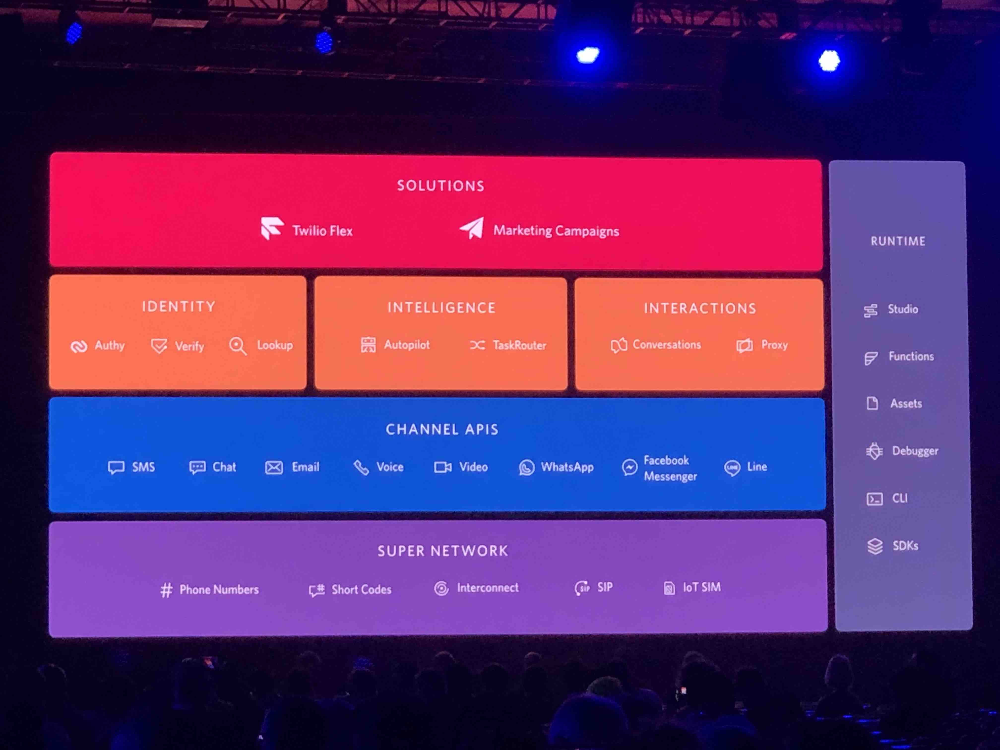
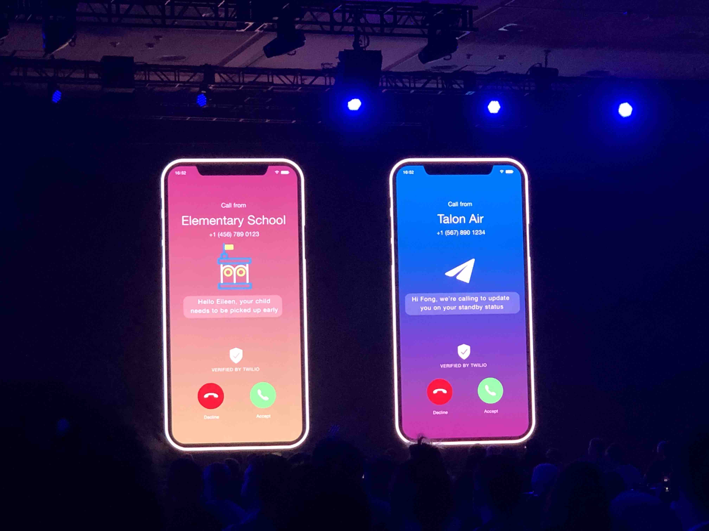

# Signal 2019 Day 2

## Index
* [Day 2 Keynote](#day-2-keynote)
* [SMS compliance](#sms-compliance)
* [Privacy in the US](#privacy-in-the-US)
* [Synchronization API](#synchronization-api)
* [Presidio](#presidio)
* [Texting First](#texting-first)
* [verified calls](#verified-calls)
* [Twilio Interconnect](#twilio-interconnect)

## Day 2 Keynote

### Twilio.org

* 3.5k organizations using twilio for non-profits
  * 2018: 25million people assisted via those non-profits
  * 2019: 100million people assisted via those non-profits
* Launching _Crisis Response and prevention initiative_
* Launching _Crisis Response Technology Network_
  * Network to share technological challenges & solutions
* $5million funding to crisis response organizations
* 1% of company equity put towards twilio.org

[top](#index)

### Customer Engagement Platform

* Super network = Phone numbers, short codes, SIP, etc...
* Channel APIs = SMS, chat, email, leverage the super network
* Service layer = They write the code for your
  * Identity, Intelligence, Interactions
* App Platform = Marketing & Flex
* Runtime = Tools to make it possible

[top](#index)

### Trusted Communications - Verified by Twilio

#### Overview

* Generally speaking, most people don't answer calls
* 75% of calls are unanswered when caller is unknown
* 48 billion robo-calls 🤖 in the USA
* $5 Average cost of outbound call from call-center
* Carriers working on protocols to verify calls

#### How it works

* displays message and logo
* Create business profile = vetted and profiled by twilio
* Verifies phone number is owned by company, that there is an API call driving it, and company is verified in order to display the logo.
* Give reason for placing call
* When call rings the reasoning and logo and etc... are displayed on device
* Parter with YouMail, hiya
* Works through an app

### IoT

* TL;DW Scooters are taking over
* Rently getting a shoutout
* Opening the "black box" of carrier connectivity with Super SIM
* Aruba (HP company) runs wifi networks for stadiums, hospitals, etc...
* Running IoT workshops with Azure & IoT hackpacks

[top](#index)

## SMS compliance

[top](#index)

## Privacy in the US

[top](#index)

## Synchronization API

[top](#index)

## Presidio

[top](#index)

## Texting First

[top](#index)

## verified calls

[top](#index)

## Twilio Interconnect

[top](#index)
