# Signal 2017

## Index
* [Day 1 Keynote](#day-1-keynote)
* [VueJS](#vuejs-from-the-backend)
* [Improving Voice Quality](#improving-voice-quality)
* [Alexa Skills with Twilio](#alexa-skills-with-twilio)
* [Making useful SMS chatbots](#making-useful-sms-chatbots)
* [2FA in 90 days](#2fa-in-90-days)
* [Whitepages Pro and Twilio](#whitepages-pro-and-twilio)
* [Mobilizing Design](#mobilizing-design)
* [Cracks in the Facade](#cracks-in-the-facade)

## Day 1 Keynote

* Today is focusing on the role of APIs in communications, products, and demos.
* 28 billion interactions with Twilio and people all around the world.
* Cover 52-70 Countries over the past year. Up to 100 countries by July _almost double_
* Over 900 total employees.. Over 400 developers (about half)

* 3 Product Priority
    * Deliver Superior Quality
    * Give Flexability
    * Get you to production fast

* Over 11k production deployments
* On plan to do 30k production deployments
* Ship major new product or feature every ~3 business days
* API uptime != API success rate. 99.999% of total API success rates
* Have 1.6 million total developer accounts on Twilio
    * But they count literally each tiny bit of code as a _developer_
* Year-over-year doubling number of new developer signups
* **ALL** new employees have to create some sort of code

* Launching an appreticeship program
* An idea to take folks from diverse backgrounds to help new developers learning to code in real environment
* Partering with code.org and code2040 to provide schooling to anyone that wants

> Every company is becomng a sofware company

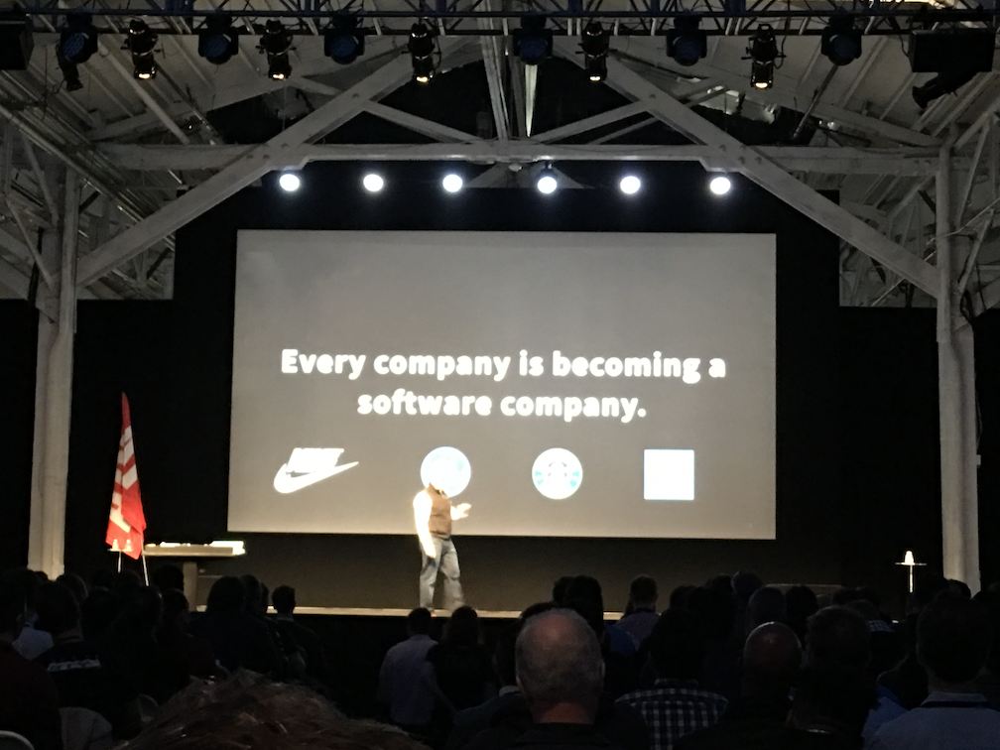

* What company and business problem *can't* be an API.
* APIs are eating the world -> Creativity and Developers are eating the world.

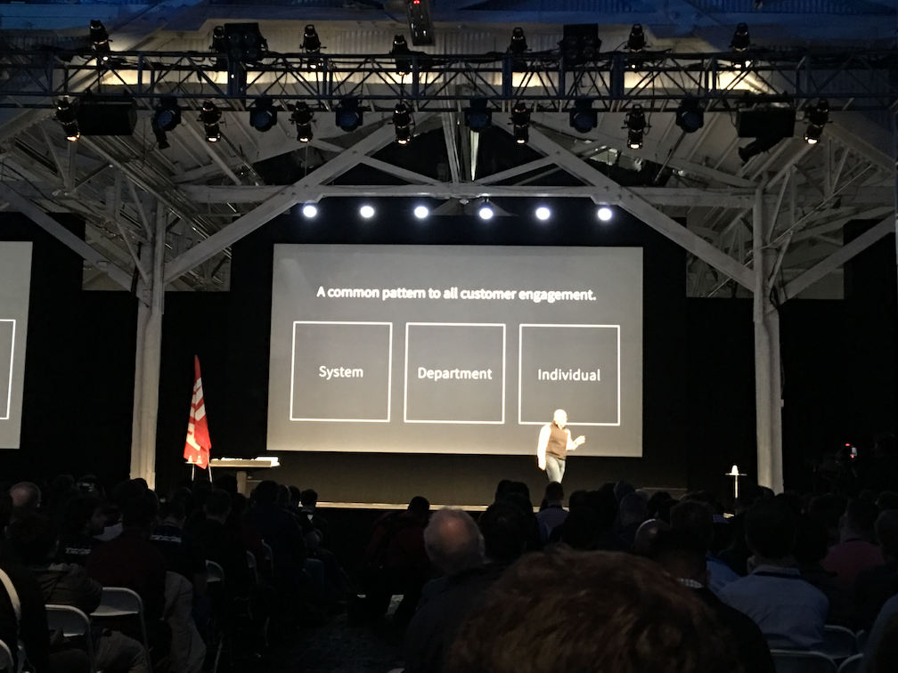

* 3 types of engagement
    * System - talking to other systems
    * Department - Customer needs to get ahold of a team
    * Individual - Customer needs to talk to an individual

* [Rinse](https://www.rinse.com/) provides on demand dry cleaning and laundry service
* SMS is an incredibly clean medium - especially compared to email.
* **ALL** sms in a continual conversation with the customer and _not_ a one-off point
* SMS makes it seamless for their customers to get ahold of whomever they need
* They do have a mobile app and website as well as SMS
    * More than **70%** interact with Rinse with SMS instead of other points

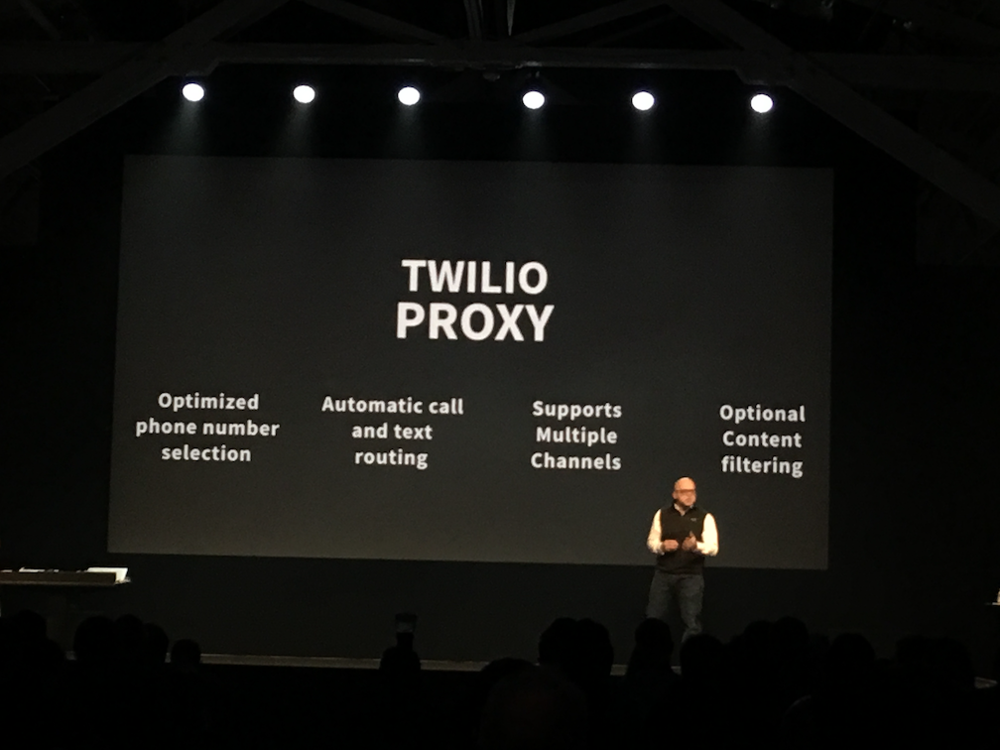

* [twilio.com/proxy](http://twilio.com/proxy) Optimize gets phone number selection
* Automatic call and text routing IE (_enable for 60 minutes_, _only for 9AM-5PM_, etc...)
* Support multiple channels
* Optional content filtering: IE _(filter out phone number, filter out credit cards, no bad language)_

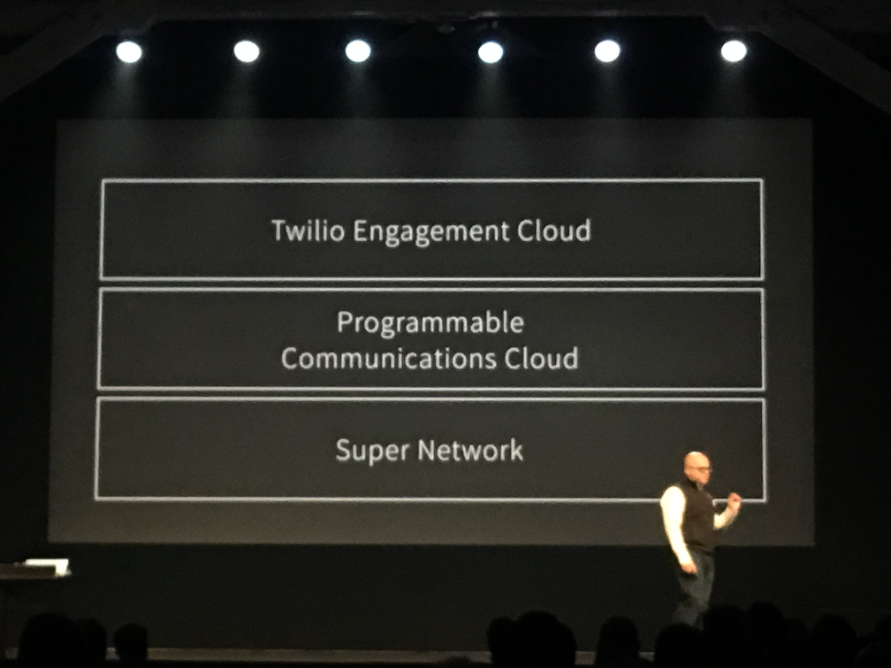

* Engagement cloud takes the holistic view that they're accomplishing more than 1 req by 1 req
* Declarative API vs Imperative API

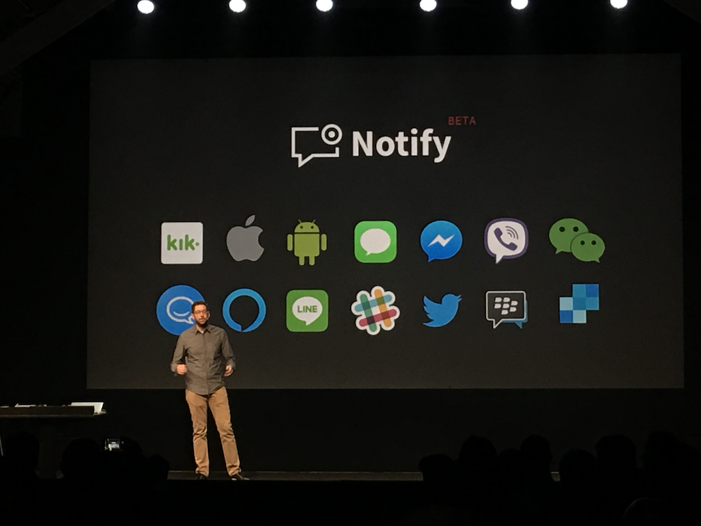

* [Notify](https://www.twilio.com/notify) abstracts away the tech details... Let you focus on _WHO_ to contact and _not_ how to contact
* Can use Notify to send messages via Alexa
* Let the developers reach users how they prefer and future proof their API calls.
* Essentially, use Twilio APIs to go via the channel and you get upgrades etc... for free. Only 1 API service to reach all the others.

* Part of the Gather verb
* 89 Languages and dilects
* `$0.02` cents per Recognition.
* Real time
* Powered by google

* Natural language processing
* Figure out intent and action
* Works for **VOICE** and **SMS** and **Alexa**
* 3 Things
    * Training environment - Teach it how to understand _your_ customers
    * Understanding Engine
    * `TWimL <UnderStand>` verb
* Can also side load the training you do `Alexa ask twilio jet to book a flight from New York to Boston`

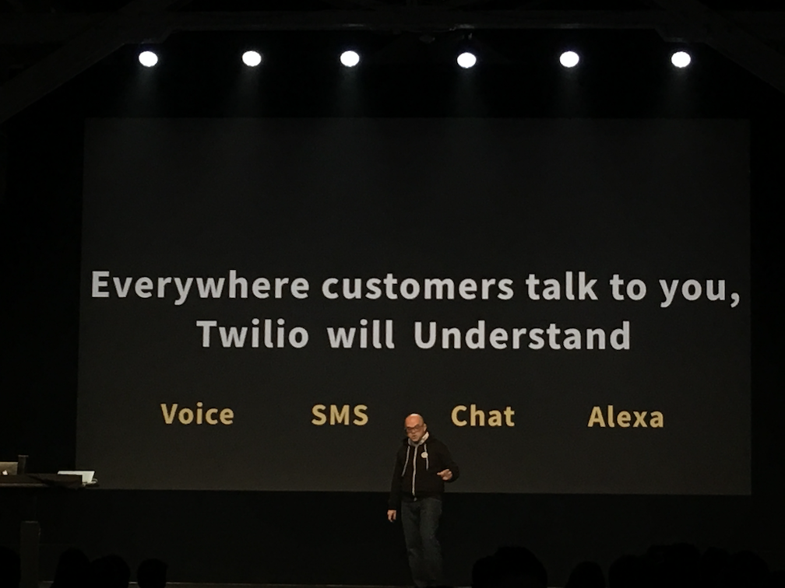

## Vue(js) from the Back(end)
### [Cassidy Williams](http://cassidoo.co/)

* WHy client-side
    * Lazy Loading
    * Same codebase across platforms
    * No full page reload
* Why does Vue exist and matter
    * It's the best parts of react and angluar
    * _JUST_ javascript
    * Errors are explicit
        * Tells you what is wrong
* Check out the [Vue CLI](https://github.com/vuejs/vue-cli) tutorial

## Improving Voice Quality
### [Gagan Mac](https://twitter.com/@gaganmac)

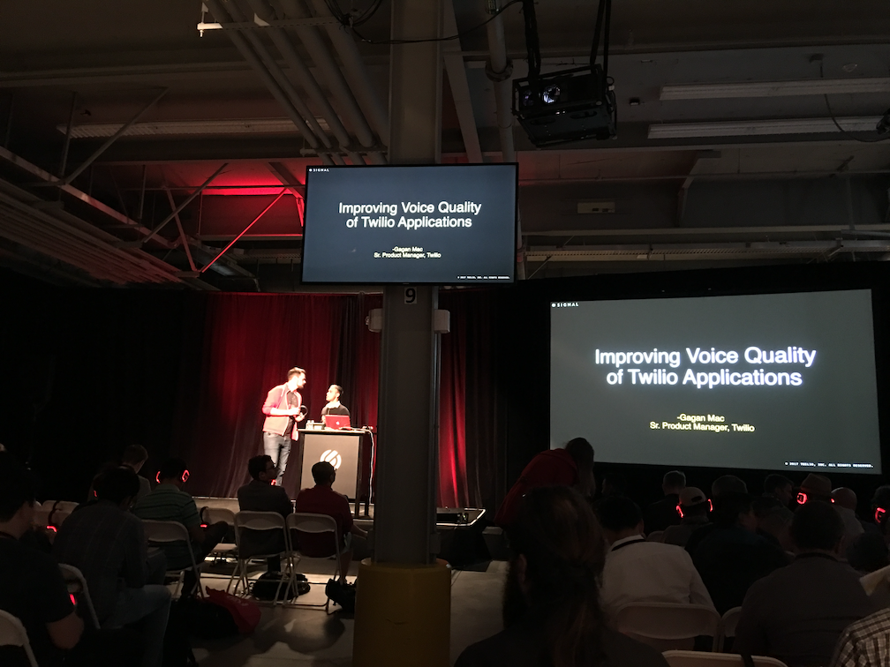

* A lot of this is focusing on SIP calls and Softphones
* Nature of live calls is that every single second counts
* Call flows have many many variables: _(network, computer, headset, etc...)_
* Framework for addressing call quality:
    * Prevent issues (audio problems)
    * Patch (in flight fixes): Walk around find a better signal, adjust headset
    * Promptly diagnose
    * Constantly monitor

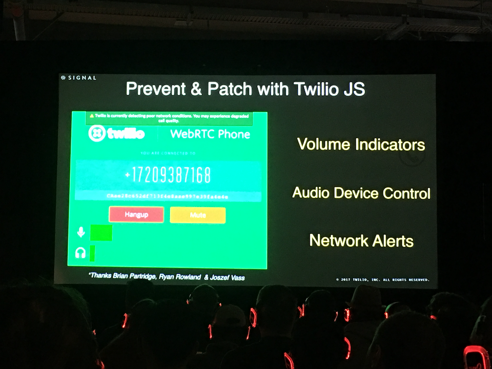

* Use Twilio-JS *front end*
    * Network alerts
    * Volume alerts
    * Network indicators

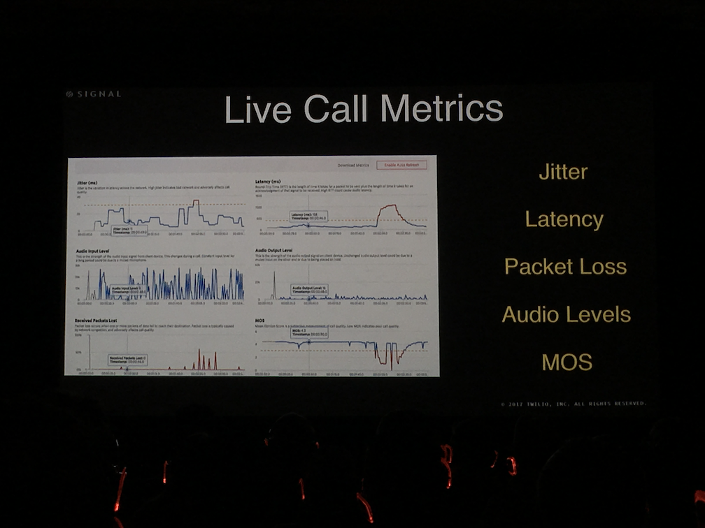

* [Voice Insights](https://www.twilio.com/voice/insights) - let you monitor and analyze quality in realtime
* Then the whole thing is shoved to a dashboard
    * Call disconnects
    * IP addresses
    * etc...

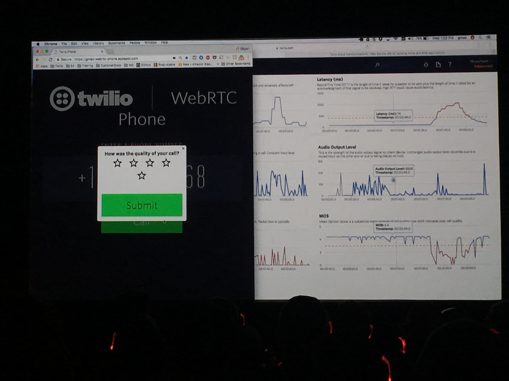

* After the call is over it shows you the feedback (if given) and lets you find and plug holes.
* Also works a bit similarlly for Carrier calls as well.
    * Who hung up, What were the numbers, networks invovled, users in region affected, etc...
* Audio Trace allows you to find last mile problems

## Alexa Skills with Twilio
### [Jesse Friedman](https://jesse.ws/)

* Primary platform is AWS Lambda/microservices
* Intent schema: specifies the "intents" a user can deliver to your skill
    * JSON doc that tells alexa how to do things

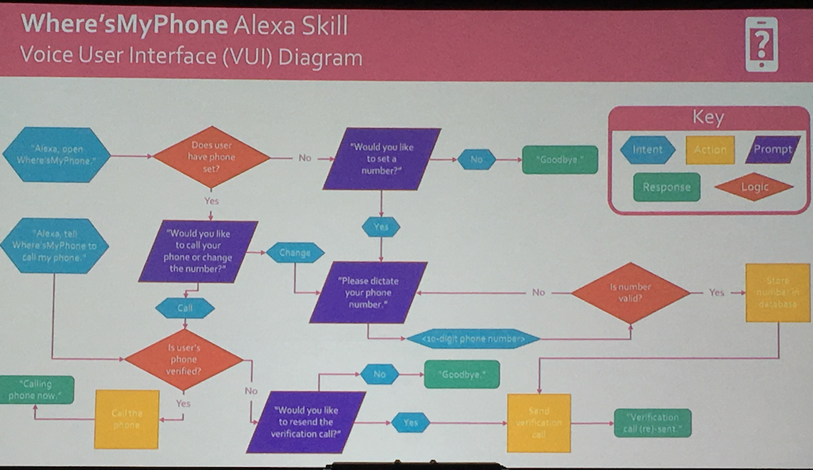

* Composed of a couple Lambda functions, "skill" and "caller"
* Uses [apex.run](http://apex.run/) to deploy and manage the microservice

## Making useful SMS chatbots
### Elizabeth Ferrao

## 2FA in 90 days
### Ian McChord

## Whitepages Pro and Twilio
### Jordan Reynolds

## Mobilizing Design
### Dr. Jessica Rothenberg-Aalami

## Cracks in the Facade
### Jonathon Kingsley

