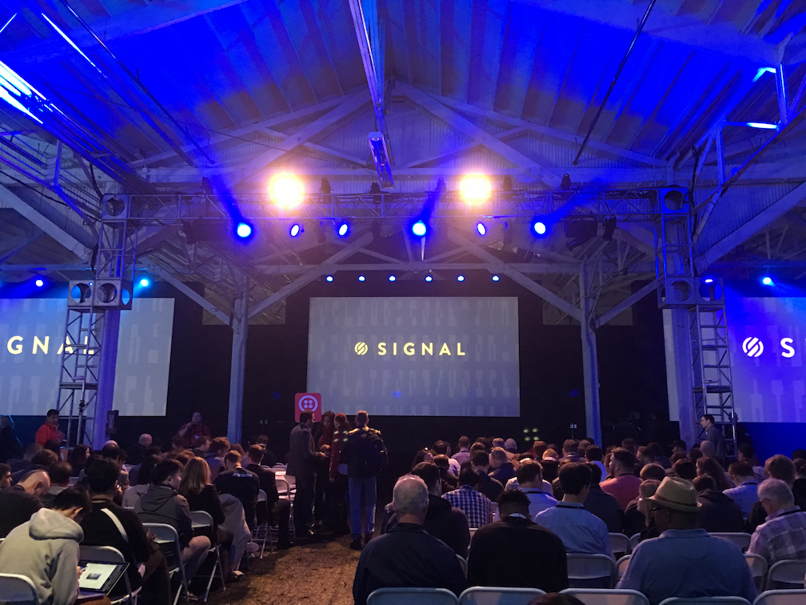
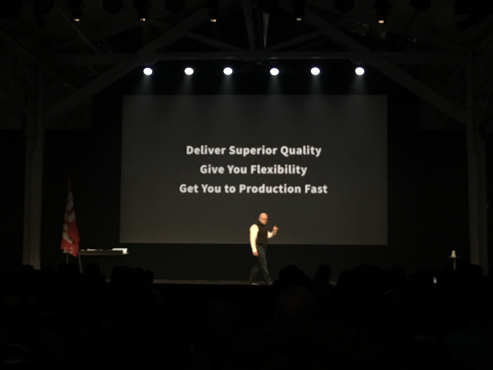
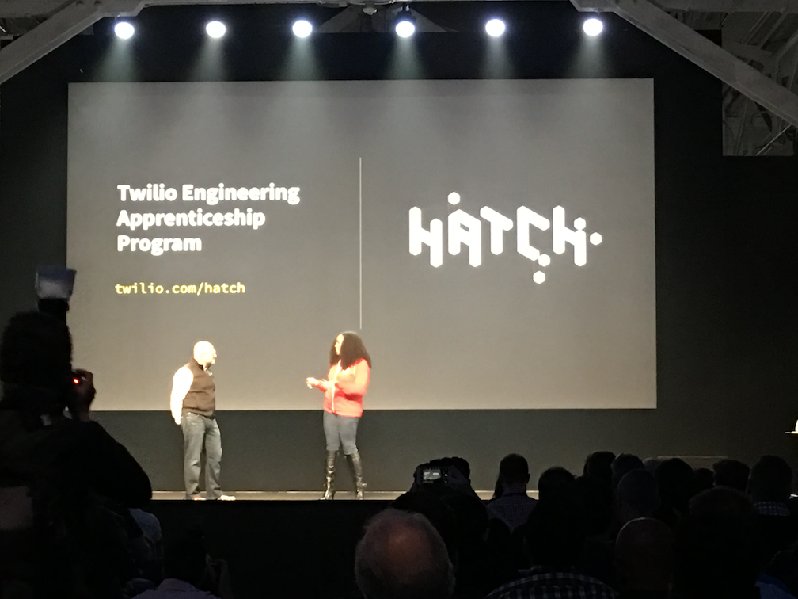

# Signal 2017

## Day 1 Keynote

* Today is focusing on the role of APIs in communications, products, and demos.
* 28 billion interactions with Twilio and people all around the world.
* Cover 52-70 Countries over the past year. Up to 100 countries by July _almost double_
* Over 900 total employees.. Over 400 developers (about half)

* 3 Product Priority
    * Deliver Superior Quality
    * Give Flexability
    * Get you to production fast

* Over 11k production deployments
* On plan to do 30k production deployments
* Ship major new product or feature every ~3 business days
* API uptime != API success rate. 99.999% of total API success rates
* Have 1.6 million total developer accounts on Twilio
    * But they count literally each tiny bit of code as a _developer_
* Year-over-year doubling number of new developer signups
* **ALL** new employees have to create some sort of code

* Launching an appreticeship program
* An idea to take folks from diverse backgrounds to help new developers learning to code in real environment
* Partering with code.org and code2040 to provide schooling to anyone that wants