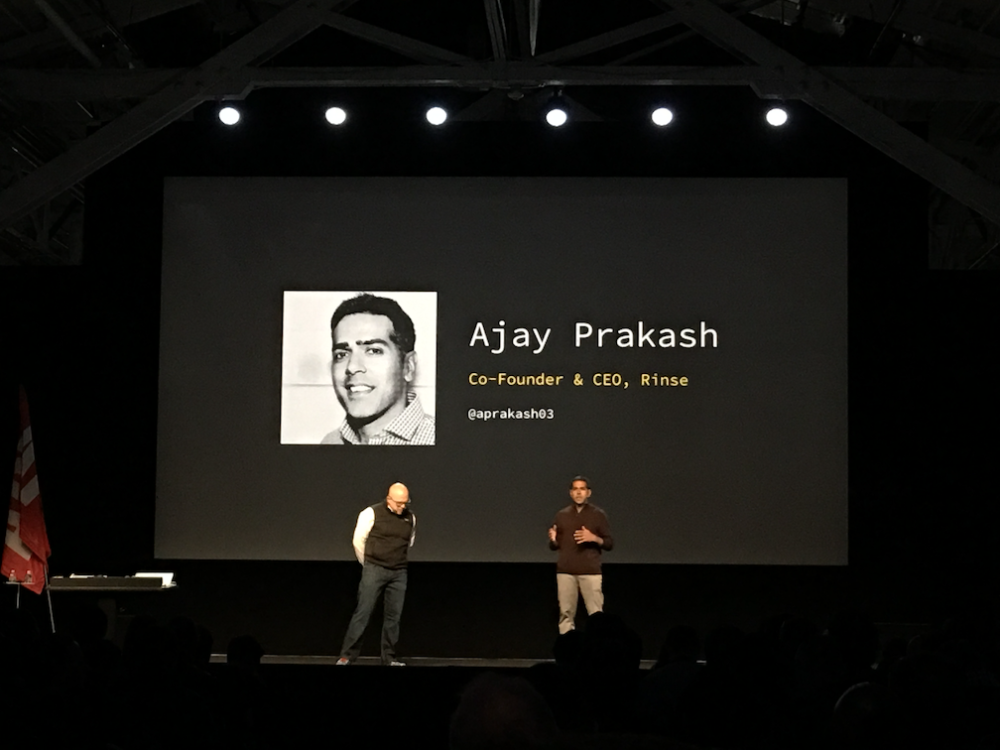
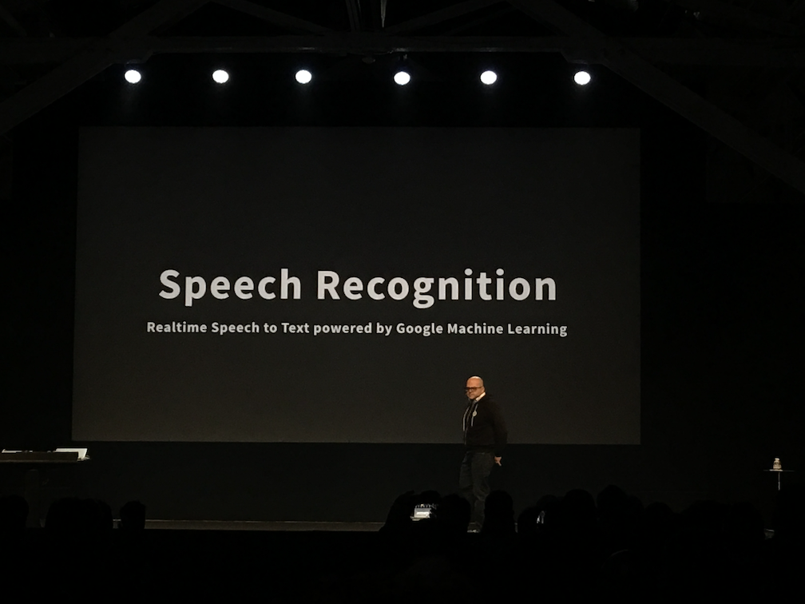
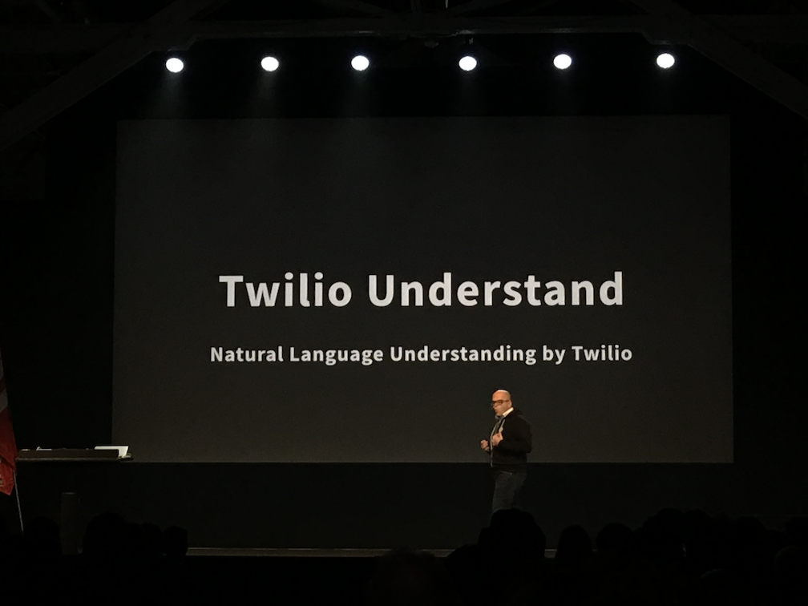

# Signal 2017

## Index
* [Day 1 Keynote](#day-1-keynote)

## Day 1 Keynote

* Today is focusing on the role of APIs in communications, products, and demos.
* 28 billion interactions with Twilio and people all around the world.
* Cover 52-70 Countries over the past year. Up to 100 countries by July _almost double_
* Over 900 total employees.. Over 400 developers (about half)

* 3 Product Priority
    * Deliver Superior Quality
    * Give Flexability
    * Get you to production fast

* Over 11k production deployments
* On plan to do 30k production deployments
* Ship major new product or feature every ~3 business days
* API uptime != API success rate. 99.999% of total API success rates
* Have 1.6 million total developer accounts on Twilio
    * But they count literally each tiny bit of code as a _developer_
* Year-over-year doubling number of new developer signups
* **ALL** new employees have to create some sort of code

* Launching an appreticeship program
* An idea to take folks from diverse backgrounds to help new developers learning to code in real environment
* Partering with code.org and code2040 to provide schooling to anyone that wants

> Every company is becomng a sofware company

* What company and business problem *can't* be an API.
* APIs are eating the world -> Creativity and Developers are eating the world.

* 3 types of engagement
    * System - talking to other systems
    * Department - Customer needs to get ahold of a team
    * Individual - Customer needs to talk to an individual

* [Rinse](https://www.rinse.com/) provides on demand dry cleaning and laundry service
* SMS is an incredibly clean medium - especially compared to email.
* **ALL** sms in a continual conversation with the customer and _not_ a one-off point
* SMS makes it seamless for their customers to get ahold of whomever they need
* They do have a mobile app and website as well as SMS
    * More than **70%** interact with Rinse with SMS instead of other points

* [twilio.com/proxy](http://twilio.com/proxy) Optimize gets phone number selection
* Automatic call and text routing IE (_enable for 60 minutes_, _only for 9AM-5PM_, etc...)
* Support multiple channels
* Optional content filtering: IE _(filter out phone number, filter out credit cards, no bad language)_

* Engagement cloud takes the holistic view that they're accomplishing more than 1 req by 1 req
* Declarative API vs Imperative API

* [Notify](https://www.twilio.com/notify) abstracts away the tech details... Let you focus on _WHO_ to contact and _not_ how to contact
* Can use Notify to send messages via Alexa
* Let the developers reach users how they prefer and future proof their API calls.
* Essentially, use Twilio APIs to go via the channel and you get upgrades etc... for free. Only 1 API service to reach all the others.

* Part of the Gather verb
* 89 Languages and dilects
* `$0.02` cents per Recognition.
* Real time

* Natural language processing
* Figure out intent and action
* 3 Things
    * Training environment - Teach it how to understand _your_ customers
    * Understanding Engine
    * `TWimL <UnderStand>` verb
