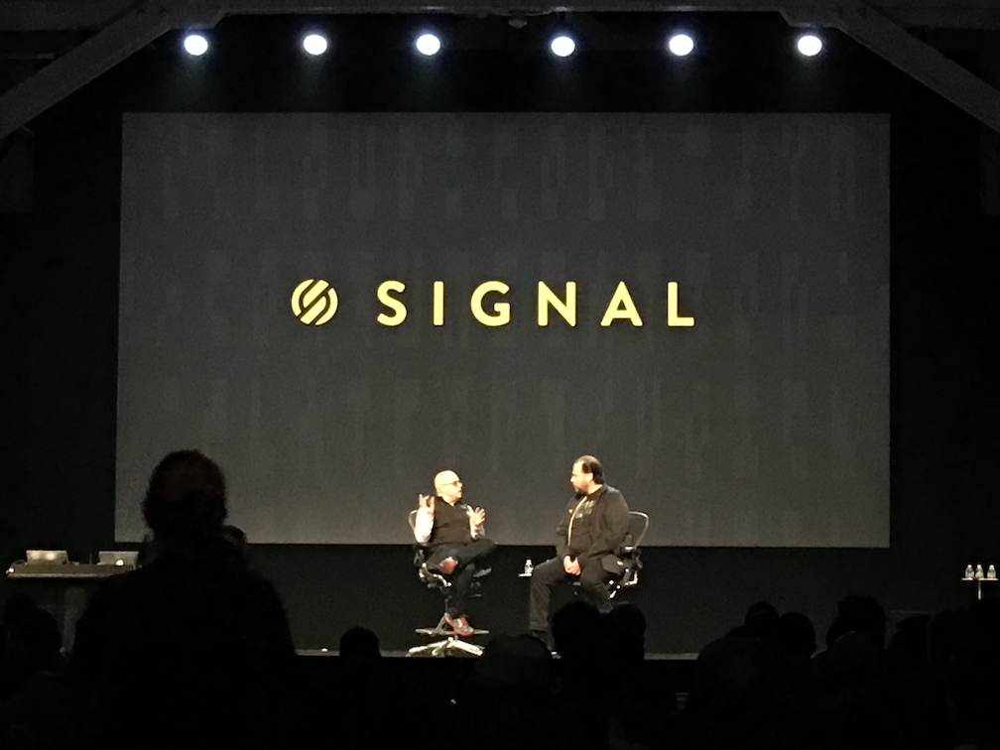

# Signal 2017 Day 2

## Index

* [Day 2 Keynote](#day-2-keynote)
* [Solving Sudoku in Swift](#solving-sudoku-in-swift)
* [Build and Scale Real-Time Video with Programmable Video](#build-and-scale-real-time-video-with-programmable-video)
* [Chat Bots + IRL Bots: A Perfect Collision](#chat-bots--irl-bots-a-perfect-collision)
* [Programmable Voice Meets Custom Vocabulary Speech Analytics](#programmable-voice-meets-custom-vocabulary-speech-analytics)
* [Examining the Barriers to Contributing to Open Source](#examining-the-barriers-to-contributing-to-open-source)
* [Improving the Developer Onboarding Experience](#improving-the-developer-onboarding-experience)
* [NESpectre: The Massively Multi-Haunted NES](#nespectre-the-massively-multi-haunted-nes)
* [Crowdsourcing Music via WebSockets](#crowdsourcing-music-via-websockets)

## Day 2 keynote

* Twilio dedicates 1% of equity to fund [twilio.org](https://www.twilio.org/) in the next 10 years
* 300,000,000 (300 million) messages have been sent using twilio.org
* Twilio.org impact fund will provide grants and volunteer time
* Open Data Notifications -> Subscribe to notifications on issues that you care about.

* Programmable wireless - Twilio powered data, voice, messaging, iOT -> SIM Cards
* Bikes, restauruant printers, cardiac arrest monitoring watch
* Twilio Blueprints -> Step by step guides to build common use cases for iOT devices.
* Trust on-board session management for trust iOT
* New SIMs now available to 100+ countries (today in preview)

* 1% Pledge from salesforce lead to atlassian and twilio
* Automatic just contribute to non-profits
* Over 3k companies have now pledged 1%

* Twilio runtime is focusing on removing the mundane tasks and giving it to you as part of everyproduct
* Twilio introducing [Functions](https://www.twilio.com/functions)

* Rooms API -> takes care of webrtc for you
* Push new version of SDK every 2 weeks
* Can record/ monitor/ channel management etc...

* Voice insights brought resolvation time from days to hours.
* Twilio runs 10,000s of tests on their carriers all of the time
* They capture 1.1B datapoints per day on their networks.

[top](#index)

## Solving Sudoku in Swift
### [Soroush Khanlou](https://twitter.com/@khanlou)

[top](#index)

## Build and Scale Real-Time Video with Programmable Video
### Rob Brazier & Luis Lopez

[top](#index)

## Chat Bots + IRL Bots: A Perfect Collision
### [Suz Hinton](https://twitter.com/@noopkat)

[top](#index)

## Programmable Voice Meets Custom Vocabulary Speech Analytics
### John Bocharov & Vineet Agarwal

[top](#index)

## Examining the Barriers to Contributing to Open Source
### Saron Yitbarek

[top](#index)

## Improving the Developer Onboarding Experience
### Kyle Woumn & Malika Nikhmonova

[top](#index)

## NESpectre: The Massively Multi-Haunted NES
### [Andrew Reitano](https://twitter.com/@batslyadams)

[top](#index)

## Crowdsourcing Music via WebSockets
### [Dan Gorelick](https://twitter.com/@dqgorelick)

[top](#index)
