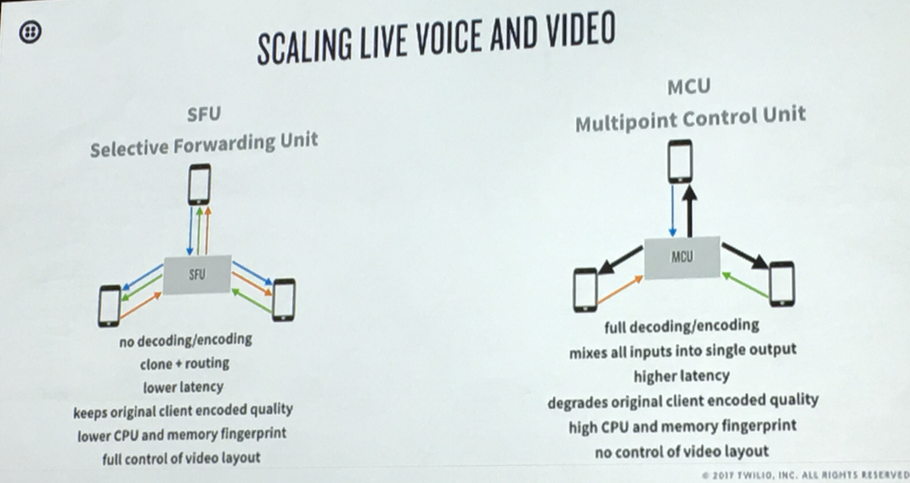

# Signal 2017 Day 2

## Index

* [Day 2 Keynote](#day-2-keynote)
* [Solving Sudoku in Swift](#solving-sudoku-in-swift)
* [Build and Scale Real-Time Video with Programmable Video](#build-and-scale-real-time-video-with-programmable-video)
* [Chat Bots + IRL Bots: A Perfect Collision](#chat-bots--irl-bots-a-perfect-collision)
* [Programmable Voice Meets Custom Vocabulary Speech Analytics](#programmable-voice-meets-custom-vocabulary-speech-analytics)
* [Examining the Barriers to Contributing to Open Source](#examining-the-barriers-to-contributing-to-open-source)
* [Improving the Developer Onboarding Experience](#improving-the-developer-onboarding-experience)
* [NESpectre: The Massively Multi-Haunted NES](#nespectre-the-massively-multi-haunted-nes)
* [Crowdsourcing Music via WebSockets](#crowdsourcing-music-via-websockets)

## Day 2 keynote

* Twilio dedicates 1% of equity to fund [twilio.org](https://www.twilio.org/) in the next 10 years
* 300,000,000 (300 million) messages have been sent using twilio.org
* Twilio.org impact fund will provide grants and volunteer time
* Open Data Notifications -> Subscribe to notifications on issues that you care about.

* Programmable wireless - Twilio powered data, voice, messaging, iOT -> SIM Cards
* Bikes, restauruant printers, cardiac arrest monitoring watch
* Twilio Blueprints -> Step by step guides to build common use cases for iOT devices.
* Trust on-board session management for trust iOT
* New SIMs now available to 100+ countries (today in preview)

* 1% Pledge from salesforce lead to atlassian and twilio
* Automatic just contribute to non-profits
* Over 3k companies have now pledged 1%

* Twilio runtime is focusing on removing the mundane tasks and giving it to you as part of everyproduct
* Twilio introducing [Functions](https://www.twilio.com/functions)

* Rooms API -> takes care of webrtc for you
* Push new version of SDK every 2 weeks
* Can record/ monitor/ channel management etc...

* Voice insights brought resolvation time from days to hours.
* Twilio runs 10,000s of tests on their carriers all of the time
* They capture 1.1B datapoints per day on their networks.
* [Hosted SMS](https://www.twilio.com/sms/hosted) - Enable texting on any number

* Chat and voice framework to build a slick user experience.
* Mostly configurable CSS for layouts
* Part of all the new SDKs

[top](#index)

## Solving Sudoku in Swift
### [Soroush Khanlou](https://twitter.com/@khanlou)

* `let ` is immutable
* `var` is mutable
* Check out his [github](https://github.com/khanlou)
* How to solve any [sudoku](http://norvig.com/sudoku.html)
* Swift has two patterns for data
    * Class
    * Struct -> if you have a reference to a struct, it's yours. So if you mutate it doesn't affect anyone else;
* Sequence and collection handling is well done in swift
* Swift's error handling system is very explicit because of the Type System

[top](#index)

## Build and Scale Real-Time Video with Programmable Video
### Rob Brazier & Luis Lopez

* Voice and messaging is great, but doesn't work for everything
    * Doctors
    * Developer hiring - hackerrannk
    * Online Bank - Monese

> Video calling is the fastest growing activity millennials do on their phones.

* 87% of millennials managers perfer video calling for collaboration
* By 2018 more than 6.2 **BILLION** people will be using a webRTC capable device

> Humans process data at a _much_ higher rate than other senses

* Twilio Rooms (group rooms) - 50 max connections and recordable via Twilio.

* Flexible routing API -> selective forwarding enables dynamic, richer applications at lower costs.
* On Amazon machines, can route up to 3,000 tracks
* Twilio's SFU determines the quality for each client
    * Simulcast packages various levels of quality to be processed by the SFU
* SFU can handle multiple codecs from/to other clients _(H.264, VP8, etc...)_
* Twilio's SFU provides a _single connection_ to the client _(vs mutliple)_:
    * Get full WebRTC capabilities
    * Higher efficiency
    * Enables intelligent policies

[top](#index)

## Chat Bots + IRL Bots: A Perfect Collision
### [Suz Hinton](https://twitter.com/@noopkat)

* Check out her [github link](https://github.com/noopkat)
* What if a chat bot could communicate to an `irl` bot
* Twitch -> NodeJS Stream -> MQTT Broker (very lightweight comm protocol for hardware) -> Something??
* Using [microsoft bot framework](https://dev.botframework.com/)

[top](#index)

## Programmable Voice Meets Custom Vocabulary Speech Analytics
### John Bocharov & Vineet Agarwal

* Get callbacks when certain triggers happen.
    * Get what call the trigger happened on.
    * Twilio addon
* Voicebase in 60s
    * Cloud hosted pay-as-you-go speech analytics API
    * Provide customers to answers to _what_ is in their call
* Recording in dual channel produces much better results
* Live credit cards and SSNs are automatically redacted from the recording
* Get emotional predictors

* Really simple ways to view what you're saying
    * Don't take over conversation
    * Don't speak too fastly or too slowly

[top](#index)

## Examining the Barriers to Contributing to Open Source
### Saron Yitbarek

[top](#index)

## Improving the Developer Onboarding Experience
### Kyle Woumn & Malika Nikhmonova

[top](#index)

## NESpectre: The Massively Multi-Haunted NES
### [Andrew Reitano](https://twitter.com/@batslyadams)

[top](#index)

## Crowdsourcing Music via WebSockets
### [Dan Gorelick](https://twitter.com/@dqgorelick)

[top](#index)
