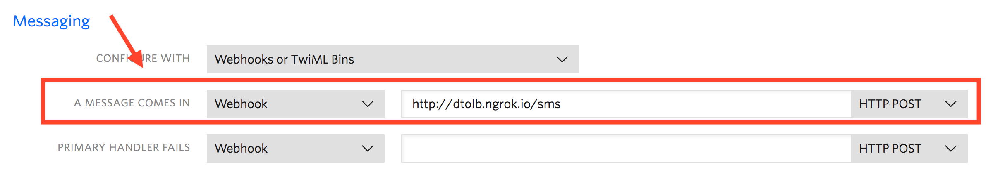

# TWILIO QUEST

## Prereqs:
* `export TWILIO_SID=ACasdf`
* `export TWILIO_TOKEN=dfasdfasdf`
* `export TWILIO_NUMBER=+12223334444`

## Things to run:

### Send time and picture to numbers on the command line:

[letsGetLocal.js](letsGetLocal.js)

`npm run getLocal --number +13334445555`

### Auto respond

Configure ngrok to point to local machine and setup twilio to send SMS webooks to `http://{ngrok.io}/sms`

[newApp.js](newApp.js)

`npm run newApp`

### Reminders

Using the same configuration as [Auto Respond](#auto-respond)

[reminders.js](reminders.js)

`npm run reminders`