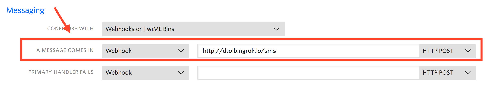

# TWILIO QUEST

## Prereqs:
* `export TWILIO_SID=ACasdf`
* `export TWILIO_TOKEN=dfasdfasdf`
* `export TWILIO_NUMBER=+12223334444`

## Things to run:

### Send time and picture to numbers on the command line:

[letsGetLocal.js](letsGetLocal.js)

`npm run getLocal --number +13334445555`

### Auto respond

Configure ngrok to point to local machine and setup twilio to send SMS webooks to `http://{ngrok.io}/sms`

[newApp.js](newApp.js)

`npm run newApp`

### Reminders

Using the same configuration as [Auto Respond](#auto-respond)

[reminders.js](reminders.js)

`npm run reminders`

### statusCallback

Using the same configuration as [Reminders](#reminders)

[statusCallback.js](statusCallback.js)

`npm run statusCallback`

### Delete message

`npm run deleteMessage`

### Tollfree texting

**NEED TO ORDER A TOLLFREE NUMBER AND SET CALLBACKURL TO YOUR SERVER**

Using the same configuration as [Reminders](#reminders)

[tollfreeStatusCallback.js](tollfreeStatusCallback.js)

`npm run tollFree`

### Co Pilot

Configure copilot and:

`export TWILIO_CO=asdfas`

[coPilot.js](coPilot.js)

`npm run coPilot --number +13334445555`

### Swarm

DDoS a phone number

[coSwarm.js](coSwarm.js)

`npm run swarm --number +13334445555`

### Dashboard

Get a dashboard of SMS usage

[dashboard.js](dashboard.js)

`npm run dashboard`
